# Declaring an Aspect: Designing the Wrapping Paper* 🎁

Mawa, manam AOP engine ni on chesam. Ippudu asalu pani modalu. We need to design our first roll of "gift wrapping paper". Spring lo, ee wrapping paper eh mana **Aspect**.

An aspect is just a regular Java class. Daaniki special powers ivvadaniki, manam daani meeda `@Aspect` ane crown pedatam. 👑

\* **(This is the first practical step in writing AOP code. Very important.)**

### Source URL
[https://docs.spring.io/spring-framework/reference/core/aop/ataspectj/at-aspectj.html](https://docs.spring.io/spring-framework/reference/core/aop/ataspectj/at-aspectj.html)

### The Two Golden Rules for an Aspect

Oka class ni aspect ga cheyalante, rendu rules follow avvali:

1.  **Wear the Crown (`@Aspect`):**
    *   The class must be annotated with `@Aspect`. Idi Spring ki cheptundi, "Hey, I'm not a normal class. I am an Aspect. I contain special instructions (Advice and Pointcuts)."

2.  **Be a Bean (Be in the Container):**
    *   Spring, aspect logic ni apply cheyalante, mundu aa aspect class ki oka object create cheyali. Ante, the aspect itself **must be a Spring bean**.
    *   How do we make it a bean? Just like any other bean!
        *   **The Easy Way:** Add `@Component` to the aspect class and let `@ComponentScan` find it.
        *   **The Manual Way:** Create a `@Bean` method in a `@Configuration` class that returns an instance of your aspect.

```mermaid
graph TD
    A["Your Java Class"];
    A -- "Add Annotation" --> B["@Aspect<br/>(The Crown 👑)"];
    A -- "Add Annotation" --> C["@Component<br/>(The Entry Pass 🎟️)"];
    B & C --> D{Spring recognizes it as a<br/>special, managed Aspect Bean};

    style D fill:#cde4ff,stroke:#004a9e
```



### Example: Our First (Empty) Aspect

Let's create our first aspect. Ippudu deenilo emi logic undadu, just oka "design" matrame.

```java
import org.aspectj.lang.annotation.Aspect;
import org.springframework.stereotype.Component;

@Aspect    // Rule 1: It's an Aspect!
@Component // Rule 2: It's a Bean!
public class LoggingAspect {
    // Ikkada manam mana Advice (what to do) and
    // Pointcuts (where to do it) define chestam.
    // We will do this in the next lessons.

    public LoggingAspect() {
        System.out.println("LoggingAspect (our wrapping paper) has been created!");
    }
}
```
Anthe! Spring ippudu ee `LoggingAspect` ni oka bean ga create chesi, adi AOP kosam ready ga undi ani register cheskuntundi.

### ⚠️ A Very Important Rule: Aspects Cannot Be Advised!
Mawa, idi oka important "gotcha". Spring lo, oka aspect inkoka aspect ni advise cheyaledu. Ante, mana gift wrapping paper ki malli inkoka wrapping paper chuttalemu.

The `@Aspect` annotation on a class marks it as special and **excludes it from being auto-proxied** by other aspects. This is to prevent infinite loops and confusing behavior.

### Mawa's Cliffhanger 🧗
Super! Mana wrapping paper (`Aspect`) ready ga undi. Kani, ee wrapping paper ni ഏ gift ki chuttali? Oka chinna gift box ka, leda pedda TV ka? We need to give it instructions. Ee instructions eh `Pointcut`. Next, we will learn how to write a "pointcut" to tell our aspect exactly which methods to target. Let's learn to aim! 🎯
