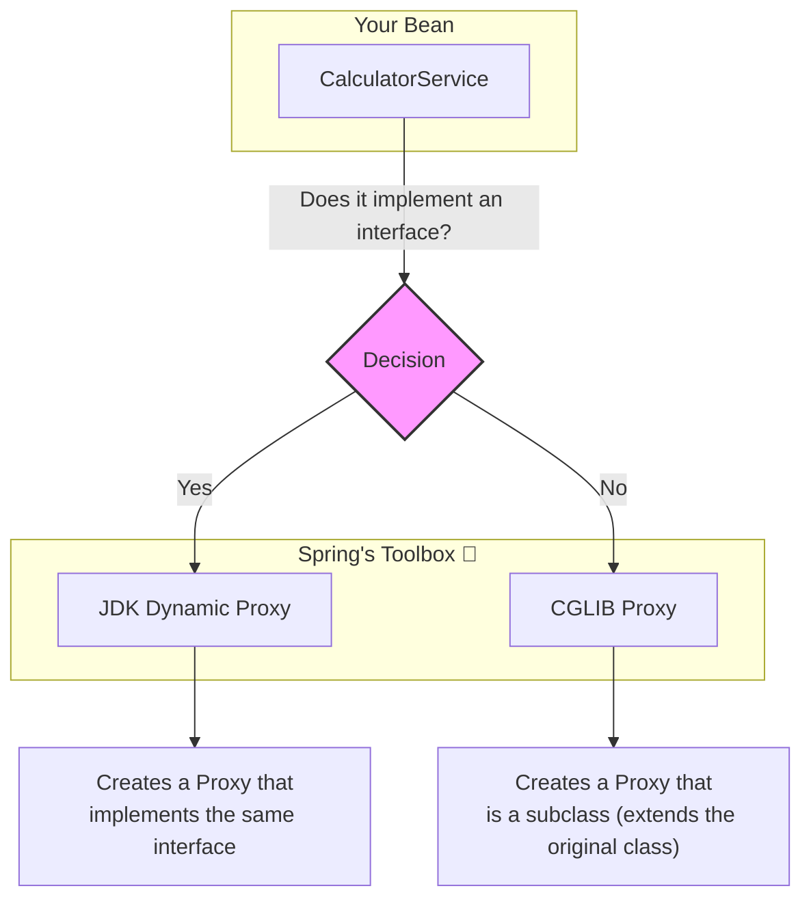

# 7. AOP Proxies: The Magic Behind the Scenes (JDK vs. CGLIB) 🎭

Mawa, manam `AopIntegrationTest` lo `calculator.getClass().getName()` ani print chesinappudu, `...CalculatorService$$SpringCGLIB$$...` lanti perochindi kada? Asalu aa `CGLIB` enti? Mana class peru `CalculatorService` matrame kada? 🤔

Welcome to the secret world of AOP Proxies! Idi AOP lo most important "behind-the-scenes" concept. Idi ardam aithe, nuvvu AOP ni inka deep ga appreciate chestav. Let's dive in!

## How Does Spring AOP Work?

Spring AOP anedi **Proxy-Based** design pattern ni vadutundi. Ante, Spring mana original `CalculatorService` bean ni direct ga ivvakunda, daaniki బదులుగా daani **stunt double** ni istundi. Ee stunt double ne manam **AOP Proxy** antam.

Ee proxy, mana original object mundu nilchuni, anni incoming calls ni intercept chestundi. Appudu, adi mana aspect lo unna advice (logging, security logic) ni run chesi, *tarvata* matrame original method ni call chestundi.

Ee proxy ni create cheyadaniki, Spring ki rendu options unnayi.



### 1. JDK Dynamic Proxies

*   **When is it used?** Mana target bean (`CalculatorService`) oka **interface** ni implement chestunte, Spring by default ee proxy ni create chestundi.
*   **How it works:** Idi Java lo unna built-in feature. Ee proxy kuda mana original class implement chesina adhe interface ni implement chestundi. It's like a stand-in actor who knows all the same lines (methods) from the script (interface).
*   **Limitation:** It can only proxy methods that are defined in the interface. Class lo unna extra public methods (interface lo lenivi) advise cheyabadavu.

### 2. CGLIB Proxies

*   **When is it used?** Mana target bean **em interfaces implement cheyakapothe**, Spring CGLIB (Code Generation Library) ane third-party library ni use chesi, ee proxy ni create chestundi. Mana `CalculatorService` ki interface ledu, anduke manaki CGLIB proxy vachindi.
*   **How it works:** CGLIB runtime lo mana `CalculatorService` class ki oka **subclass** (child class) ni create chestundi. Ee subclass, original methods ni override chesi, daanilo advice logic ni add chestundi.
*   **Advantage:** It can proxy all public and protected methods, not just the ones from an interface.
*   **Limitation:** It cannot proxy `final` classes or `final` methods, because they cannot be subclassed or overridden.

## Let's See it in Action!

Ippudu manam mana code ni konchem marchi, ee rendu proxy types ni chuddam.

**Step 1: Create an Interface**
Manam `Calculator.java` ane oka interface create cheddam.

```java
// In Spring-Project/src/main/java/io/mawa/spring/core/aop/service/Calculator.java
public interface Calculator {
    int add(int x, int y);
    // ... other methods
}
```

**Step 2: Implement the Interface**
Mana `CalculatorService` ippudu ee interface ni implement chestundi.

```java
// In Spring-Project/src/main/java/io/mawa/spring/core/aop/service/CalculatorService.java
@Service
public class CalculatorService implements Calculator {
    // ... all methods
}
```

**Step 3: Run the Test**
Ippudu manam `AopIntegrationTest` ni malli run cheste, output chudu!

```
Injected Bean Class: com.sun.proxy.$Proxy63
```
Chusava! `CGLIB` poyindi, daani badulu `com.sun.proxy.$Proxy...` vachindi. This is a **JDK Dynamic Proxy**. Because our service now implements an interface, Spring switched its strategy.

### Forcing CGLIB Proxying

"Mawa, naaku interface unna sare CGLIB eh kavali" anukunte, adi kuda possible. Spring Boot lo by default CGLIB ne prefer chestaru because it's more powerful. Explicit ga cheyalante, mana `AopConfig` lo ila pettali:

`@EnableAspectJAutoProxy(proxyTargetClass = true)`

Ee `proxyTargetClass = true` anedi, "Hey Spring, interface unna, lekapoina, please use CGLIB and create a subclass proxy" ani cheptundi.

---

### Mawa's Cliffhanger 🧗

Super deep topic, mawa! Ippudu neeku Spring AOP loni "secret" telusu.

Kani inko chinna problem undi. Manam ippudu `LoggingAspect` okkate create chesam. Repu nuvvu inko aspect create chestav, maybe `SecurityAspect`. Appudu `add()` method ki mundu logging run avvala, security run avvala? Which aspect gets to run first? 🤔

Ee chaos ni control cheyadaniki, Spring manaki oka simple but powerful tool ichindi. Let's see that in our final AOP lesson!
