# 8. Advice Ordering: Controlling the Chaos! 🚦

Mawa, manam ippudu AOP lo pro level ki vellipotunnam. Oka chinna but chala important question:

Okavela manaki birdan fazla aspect unte? (If we have more than one aspect?)
1.  `LoggingAspect` - To log method calls.
2.  `SecurityAspect` - To perform security checks.
3.  `AnalyticsAspect` - To gather analytics.

Ee moodu aspects, oke method (`Calculator.add()`) ni target chestunnayi anuko. Appudu, ee mooditlo edi mundu run avutundi? Logging mundu Security check cheyali, right? Or vice-versa?

By default, Spring **does not guarantee the order** of execution for aspects. Idi chala dangerous! 🤯 Ee chaos ni control cheyakapothe, mana application unpredictable ga behave chestundi.

## The Solution: `@Order` Annotation

Ee problem ni solve cheyadaniki, Spring manaki `@Order` ane oka simple and powerful annotation ichindi.

*   **How it works:** Ee annotation ni manam mana Aspect class meeda pedatam.
*   **The Rule:** The rule is very simple: **LOWER number = HIGHER precedence**. Ante, `@Order(1)` anedi `@Order(10)` kanna mundu run avutundi.

> **Analogy:** Idi oka event lo VIP entry levels laantidi.
> *   `@Order(1)` = VVIP (Highest priority, goes in first)
> *   `@Order(10)` = VIP (Goes in after VVIP)
> *   `@Order(100)` = General Admission (Goes in last)

### The Execution Flow

Multiple aspects unnapudu, avi oka "chain" or an "onion" laaga form avutayi. The highest precedence aspect wraps all the others.

```mermaid
graph TD
    A[Client Call] --> O1["@Order(10)<br>SecurityAspect"];
    O1 -- "calls next" --> O2["@Order(20)<br>AnalyticsAspect"];
    O2 -- "calls next" --> O3["@Order(30)<br>LoggingAspect"];
    O3 -- "calls next" --> T[🎯 Target Method];

    T -- "returns" --> O3;
    O3 -- "returns" --> O2;
    O2 -- "returns" --> O1;
    O1 -- "returns to client" --> A;

    subgraph "AOP Proxy's Chain of Aspects"
        direction LR
        O1 <--> O2 <--> O3
    end
```


Ee diagram lo, `@Before` advices `10 -> 20 -> 30` order lo run avutayi. But `@After` advices reverse order lo `30 -> 20 -> 10` run avutayi. Because the chain unwinds.

### Let's See it in Code

Manam ippudu rendu kotha aspects create cheddam and vaatiki order pedadam.

**1. Security Aspect (Highest Precedence)**
```java
// In SecurityAspect.java
@Aspect
@Component
@Order(10) // Lowest number = runs first!
public class SecurityAspect {
    @Before("io.mawa.spring.core.aop.LoggingAspect.forServicePackage()")
    public void performSecurityCheck() {
        System.out.println("======> 👮‍♂️ @Order(10) Performing SECURITY CHECK!");
    }
}
```

**2. Analytics Aspect (Medium Precedence)**
```java
// In AnalyticsAspect.java
@Aspect
@Component
@Order(20) // Runs after security
public class AnalyticsAspect {
    @Before("io.mawa.spring.core.aop.LoggingAspect.forServicePackage()")
    public void gatherAnalytics() {
        System.out.println("======> 📈 @Order(20) Gathering ANALYTICS!");
    }
}
```

**3. Logging Aspect (Lowest Precedence)**
Mana existing `LoggingAspect` ki `@Order(30)` pedadam.

```java
// In LoggingAspect.java
@Aspect
@Component
@Order(30) // Runs last
public class LoggingAspect { ... }
```

Ippudu `AopDemoApp` run cheste, console lo output chala clear ga, predictable ga, manam ichina order lo vastundi!

1.  `======> 👮‍♂️ @Order(10) Performing SECURITY CHECK!`
2.  `======> 📈 @Order(20) Gathering ANALYTICS!`
3.  `✅ @Before: Calling method: ...` (from our `@Order(30)` LoggingAspect)

Success! Manam AOP chaos ni control chesam.

---

### AOP Module - The Grand Finale! 🥳

And that's a wrap on AOP, mawa! 🫡 You've done it!

Manam ee module lo concepts nerchukunnam, code rasam, proxies gurinchi telusukunnam, and finally order ni kuda control chesam. You now have a solid foundation in AOP that many senior developers lack. Take a moment and feel proud of this accomplishment! 🤗

**What's Next?**

AOP anedi Spring lo oka pillar. Now, let's move to the next massive pillar: **Transaction Management**. Database tho pani chesinappudu, mana data safe ga, consistent ga undali ante, transactions chala avasaram.

Get ready to learn how Spring makes complex transaction management incredibly simple. See you in the next chapter! 💪
