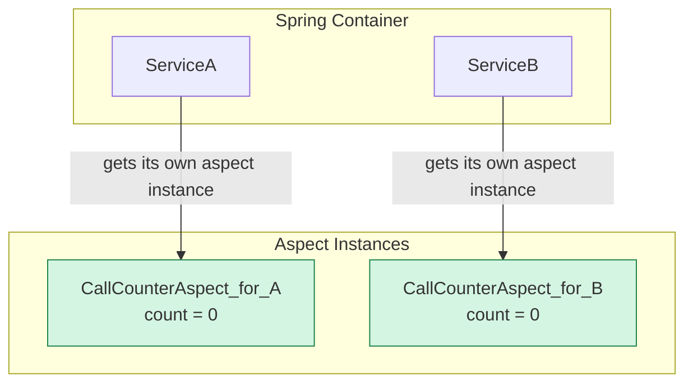

# 9. Aspect Instantiation Models: Okate Spy aa? Leka Prati Target ki okkada? 🤔

Mawa, manam ippativaraku create chesina aspects (`LoggingAspect`, `SecurityAspect`, etc.) anni kuda **singleton** beans. Ante, mana application antha start ayinappudu, prathi aspect ki okka object matrame create avutundi. Aa okka object eh application lo unna anni target beans ni advise chestundi. 99% of the time, this is exactly what you want. It's simple and efficient.

But, what if you need an aspect that maintains a separate state for each object it advises? 🤔

For example, nuvvu oka `CallCounterAspect` rayali anuko. Ee aspect, prathi `Service` bean lo unna methods enni sarlu call ayyayo count cheyali.

*   `ServiceA` ki oka separate count.
*   `ServiceB` ki oka separate count.

Singleton aspect tho idi possible aa? Kashtam. Because the aspect has only one `count` field, and it would be shared by all services. This would be a mess!

Ee lanti rare but important scenarios kosam, Spring manaki different **instantiation models** istundi.

## The Default: Singleton Model

Idi manam ippativaraku chusindi. The aspect is a singleton.

```mermaid
graph TD
    subgraph "Spring Container"
        direction LR
        A[LoggingAspect <br> (1 instance)]
        B[SecurityAspect <br> (1 instance)]
    end

    subgraph "Target Beans"
        direction LR
        T1[ServiceA]
        T2[ServiceB]
        T3[ServiceC]
    end

    A --> T1;
    A --> T2;
    A --> T3;
    B --> T1;
    B --> T2;
    B --> T3;

    style A fill:#d5f5e3,stroke:#1e8449
    style B fill:#d5f5e3,stroke:#1e8449
```
Diagram lo chudu, `LoggingAspect` and `SecurityAspect` okkate unnayi, kani avi anni services ni advise chestunnayi.

## The Advanced Models: `perthis` and `pertarget`

Ee models tho, manam prathi target bean ki oka **kotha aspect instance** ni create cheyamani Spring ki chepochu.

*   **`perthis(pointcut)`**: Creates a new aspect instance for each unique **proxy object** that matches the pointcut.
*   **`pertarget(pointcut)`**: Creates a new aspect instance for each unique **target object** that matches the pointcut.

> **Important Note:** Spring AOP lo, proxy-based avvadam valla, `perthis` and `pertarget` rendu oke laaga pani chestayi. So you can use either one.

### How to Configure?

Ee model ni manam direct ga `@Aspect` annotation lone configure chestam.

```java
@Aspect("perthis(execution(* io.mawa.spring.core.aop.service.*.*(..)))")
@Component // Still needs to be a bean, but Spring handles the lifecycle differently
public class CallCounterAspect {

    private int callCount = 0;

    @Before("execution(* io.mawa.spring.core.aop.service.*.*(..))")
    public void countCall() {
        this.callCount++;
        System.out.println("Call count for this service instance is now: " + callCount);
    }
}
```
Ippudu emavutundi?
*   Spring `ServiceA` ni advise cheyadaniki, oka `CallCounterAspect` instance ni create chestundi.
*   Spring `ServiceB` ni advise cheyadaniki, **inkoka kotha** `CallCounterAspect` instance ni create chestundi.

Prathi service ki daani own `callCount` untundi. No more shared state mess!



### When to Use This?

Mawa, honestly, chala rare ga. 99% of aspects are stateless (like our `LoggingAspect`). Stateful aspects create complexity. Kani, okavela neeku pakka state maintain cheyalsina situation vasthe, like advanced monitoring or profiling per bean instance, appudu ee `perthis` model neeku oka powerful option laaga untundi.

Knowing this exists is what matters. It shows you have a deep understanding of AOP's capabilities.

---

### Mawa's Cliffhanger 🧗

Okay, we've seen how aspects are created. Now for the final piece of the puzzle. The AOP we are using is "Spring AOP". Kani market lo "AspectJ" ane inko peru kuda vintuntav. Asalu ee renditiki teda enti? Why does Spring AOP have limitations like the "self-invocation problem"?

In our final lesson, we will compare Spring AOP with Full AspectJ. After that, your AOP knowledge will be complete. Let's go for the final showdown!
