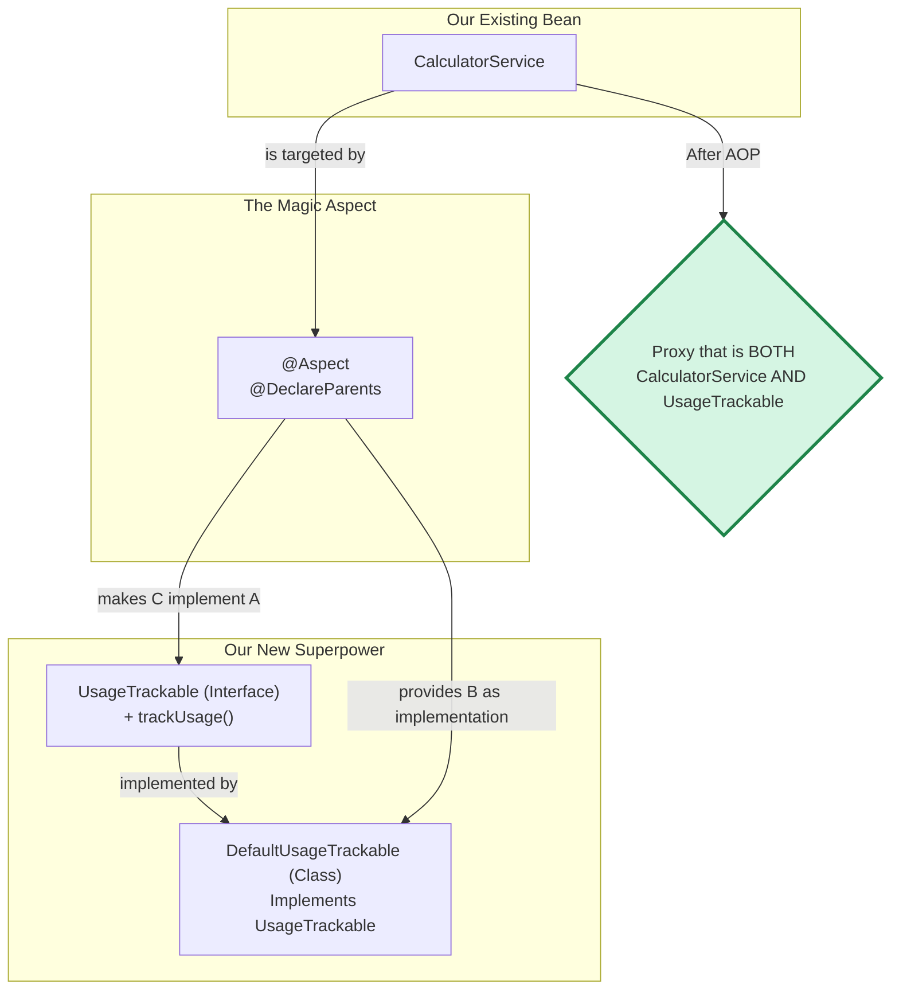

# 11. AOP Introductions: Mana Class ki Kotha Superpowers Ivvadam! ✨

Mawa, manam AOP tho existing methods chuttu logic add cheyochu ani chusam. Kani AOP inka powerful. It can give **brand new powers** to our existing classes! How? By making them implement interfaces they were never written to implement. 🤯

Ee concept ne **Introductions** or **Inter-type Declarations** antam.

## The Scenario

Imagine mana `CalculatorService` undi. Adi calculations baga chestundi. Kani, manam prathi service enni sarlu use chesaro track cheyali anukuntunnam. So, we want a `trackUsage()` method on our service.

Okate solution, prathi service class loki velli, `trackUsage()` method ni manually add cheyadam. But that's not clean! ❌

The AOP way is to "introduce" this tracking capability to all our services without touching their source code.

## The Magic: `@DeclareParents`

Ee magic cheyadaniki, manam `@DeclareParents` ane annotation ni vadatam.
*   **What it does:** It declares that all beans matching a pointcut must also implement a new interface.
*   **How it works:** Mana aspect, ee kotha interface ki oka default implementation ni kuda provide chestundi. Spring AOP proxy ee pani chuskuntundi.

### The Plan

1.  **Create the new "Superpower" (Interface):** `UsageTrackable` ane interface create cheddam.
2.  **Create the Implementation:** Ee interface ni implement chese oka class, `DefaultUsageTrackable`, create cheddam.
3.  **Create the "Introduction" Aspect:** Oka kotha aspect create chesi, daanilo `@DeclareParents` use chesi, ee kotha superpower ni mana service beans ki attach cheddam.



### Let's See the Code

**1. The Interface (`UsageTrackable.java`)**
```java
public interface UsageTrackable {
    void trackUsage();
    int getUsageCount();
}
```

**2. The Implementation (`DefaultUsageTrackable.java`)**
```java
public class DefaultUsageTrackable implements UsageTrackable {
    private int count;
    @Override
    public void trackUsage() {
        count++;
    }
    @Override
    public int getUsageCount() {
        return count;
    }
}
```

**3. The Aspect (`UsageTrackingAspect.java`)**
```java
@Aspect
@Component
public class UsageTrackingAspect {

    @DeclareParents(
        value = "io.mawa.spring.core.aop.service.*+", // The Pointcut: all classes in the service package
        defaultImpl = DefaultUsageTrackable.class   // The Implementation for the new interface
    )
    public static UsageTrackable mixin; // The new interface to introduce
}
```

### The Final Test (`AopDemoApp.java`)

Ippudu asalu magic chudu. Mana `AopDemoApp` lo, `CalculatorService` bean ni a `UsageTrackable` variable ki cast cheyochu!

```java
// In AopDemoApp.java
Calculator calculator = context.getBean(Calculator.class);
calculator.add(10, 5);

// Introduce the new power!
UsageTrackable tracker = (UsageTrackable) calculator;
tracker.trackUsage();
tracker.trackUsage();

System.out.println("Usage count: " + tracker.getUsageCount()); // Output: 2
```
Even though `CalculatorService.java` source code lo `UsageTrackable` gurinchi em ledu, AOP valla adi ippudu aa interface ni implement chestundi. This is the power of Introductions!

---

### AOP Module: The REAL Grand Finale! 🥳

Mawa, with this, you have truly completed the AOP module. You know the basics, the proxies, the ordering, and now even the most advanced topic of Introductions. Your knowledge is now officially at a pro-level. Be proud! 🫡

Next up, we will begin our journey into **Transaction Management**. Ready for a new adventure?
