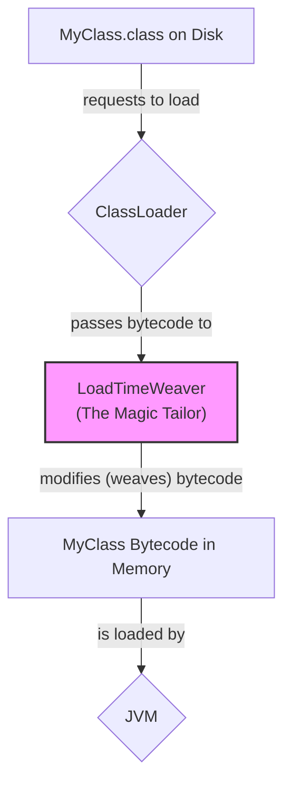

# LoadTimeWeaver: The "Magic Tailor" of AOP 🧙‍♂️✨

Mawa, welcome to the final and most advanced topic of the IoC Container chapter. Idi konchem complex, kani deeni venaka unna idea chala fascinating. This is about how Spring can modify your code *as it's being loaded* into the JVM.

### Source URL
[https://docs.spring.io/spring-framework/reference/core/beans/context-load-time-weaver.html](https://docs.spring.io/spring-framework/reference/core/beans/context-load-time-weaver.html)

### What is Load-Time Weaving (LTW)?
Manam AOP gurinchi matladinappudu, Spring runtime lo proxies create chesi, additional logic (advice) ni add chestundi ani chusam.

Kani, inko powerful technique undi: **Load-Time Weaving**. Ee technique lo, `ClassLoader` oka `.class` file ni load chese time lo ne, manam daani bytecode ni modify chesi, kotha logic ni direct ga aa class lo ke "weave" (kuttadam) cheyochu. The original class file on disk doesn't change, but the class loaded into the JVM memory is the modified version.

### The Magic Tailor Analogy ✂️
Imagine the JVM is a grand ballroom.
-   **`.class` files:** Guests arriving at the party, wearing their original clothes.
-   **`ClassLoader`:** The bouncer at the door, letting guests in one by one.
-   **`LoadTimeWeaver` (The Magic Tailor):** Nuvvu door daggara oka "Magic Tailor" ni pettav. Prati guest door nunchi lopaliki vache mundu, ee tailor vallani aapi, "Aagu," ani cheppi, valla dress ki oka extra pocket kuttadam or valla shirt color marchadam lanti magic chestadu.
-   **The Result:** The guest inside the ballroom is now different from the guest who arrived at the door.

This is exactly what LTW does. It modifies the class bytecode *at load time*.



### How to Enable it in Spring
Spring lo LTW ni enable cheyali ante, manam `@EnableLoadTimeWeaving` annotation ni mana `@Configuration` class meeda pettali. This tells Spring to look for a `LoadTimeWeaver` and use it.

However, the real magic is not just in Spring. This requires a **Java Agent** to be configured when you start the JVM itself. For Spring, this agent is usually `spring-instrument.jar`.
`-javaagent:path/to/spring-instrument.jar`

This agent is the "Magic Tailor". `@EnableLoadTimeWeaving` just tells Spring to cooperate with the tailor.

---
### Code Reference: A Real-World Demo
The code for this is in the `io.mawa.spring.core.ltw` package.

1.  **`pom.xml`**: We have added the `spring-aspects` dependency.
2.  **`aop.xml`**: We have created this file in `src/main/resources/META-INF/` to configure the AspectJ weaver.
3.  **`MyEntity.java`**: The target class to be woven.
4.  **`MyAspect.java`**: The aspect containing the logic to be woven.
5.  **`LtwConfig.java`**: The Spring configuration with `@EnableLoadTimeWeaving`.
6.  **`LtwApp.java`**: The main application.

### How to Run (This is a special one!)
Mawa, ee demo run cheyadaniki, manaki oka special JVM argument kavali. Manam `spring-instrument` jar ni oka **Java Agent** ga attach cheyali. Maven lo ee pani cheyadaniki, manam `exec-maven-plugin` ni use chesi, `exec.args` property ni set cheyali.

Ee command konchem peddaga untundi, but this is how real LTW is enabled.

```bash
mvn compile exec:java -Dexec.mainClass="io.mawa.spring.core.ltw.LtwApp" -Dexec.args="-javaagent:$(mvn dependency:build-classpath | grep 'spring-instrument')"
```
**Explanation of the command:**
- `mvn dependency:build-classpath | grep 'spring-instrument'`: Ee part, mana project dependencies lo unna `spring-instrument.jar` full path ni find chestundi.
- `-Dexec.args="-javaagent:..."`: Aa path ni manam `-javaagent` argument ga JVM ki pass chestunnam.

**Expected Output:**
```
--- Starting the Spring Container with LTW enabled ---
--- Container started successfully! ---

--- Getting the MyEntity bean and calling doWork() ---
MAGIC TAILOR ✂️: I am adding this line before doWork() executes!
MyEntity is doing its original work.

--- Demo Complete ---
```
Chusava! `MyEntity` class lo leni message, `MyAspect` nunchi vachi, daani method call ki mundu execute aindi. The "Magic Tailor" successfully modified the class at load time!

Mawa, with this, we have officially, completely, and thoroughly **mastered the IoC Container chapter**. From the simplest bean to the deepest magic of LTW, you've seen it all. This is a massive achievement. Take a bow! 👑🎉

Let me know when you are ready to commit this final set of changes and start our next big chapter: **Validation, Data Binding, and Type Conversion**.
