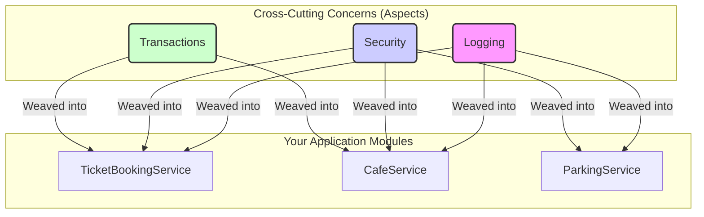

# AOP: The Superpower You Didn't Know You Needed! 🦸‍♀️

Mawa, welcome to the world of Aspect-Oriented Programming (AOP)! Idi chala cool and powerful concept. First lo konchem "enti idi?" anipinchina, okasari ardam aithe, you'll feel like a real pro developer. Idi Spring lo chala important, so let's start this adventure! 🚀

### Source URL
[https://docs.spring.io/spring-framework/reference/core/aop.html](https://docs.spring.io/spring-framework/reference/core/aop.html)

### The "Cinema Hall" Analogy 🎬

Imagine you're building a software for a cinema hall. You have different services:
- `TicketBookingService`: Books tickets.
- `CafeService`: Sells popcorn and drinks.
- `ParkingService`: Manages car parking.

Eppudu, ee anni services ki konni common tasks untayi:
1.  **Security Check:** Prati service call ki mundu, user valid aa kada ani check cheyali.
2.  **Logging:** Prati service start and end appudu, time log cheyali.
3.  **Transaction Management:** Payment jarigetappudu, transaction start chesi, successful aite commit, lekapothe rollback cheyali.

Ee common tasks ni "cross-cutting concerns" antam. Ante, ivi oka service ki matrame sambandhinchinavi kavu, system antha paakipoyi untayi.

**The Normal (Boring) Way 😫**
AOP lekapothe, manam ee logic ni prati service lo rayali.

```java
public class TicketBookingService {
    public void bookTicket() {
        // 1. Security check logic...
        // 2. Logging logic...
        // 3. Start transaction...

        // Actual business logic here...
        System.out.println("Ticket booked!");

        // 3. Commit transaction...
        // 2. Logging logic...
    }
}

public class CafeService {
    public void orderPopcorn() {
        // 1. Security check logic... (Again!)
        // 2. Logging logic... (Again!)
        // 3. Start transaction... (Again!)

        // Actual business logic here...
        System.out.println("Popcorn ordered!");

        // ... and so on
    }
}
```
**Problem enti ikkada?**
- **Code Duplication:** Same code (security, logging) chala sarlu repeat avutondi. DRY (Don't Repeat Yourself) principle ki against! ❌
- **Maintainance Nightmare:** Repu logging logic maarali ante, anni places lo velli marchali. Devuda! 😱

### The AOP (Smart) Way! ✨

AOP cheptondi: "Mawa, ee cross-cutting concerns gurinchi nuvvu worry avvaku. Business logic meeda focus chey. Ee extra panulanni nenu chuskunta."

AOP lo, ee common logic ni oka separate place lo rastam, daanini **Aspect** antam. Ee aspect ni manam business logic ki "weave" (kalapadam) chestam.


Ee diagram chudu, logging, security, and transactions anevi separate "Aspects" ga unnayi, and avi mana main services loki inject avutunnayi, without polluting the business logic. Clean and beautiful! 😍

### Key Points from the Docs 📝

*   **AOP complements OOP:** Object-Oriented Programming lo unit of modularity **class** aite, AOP lo unit of modularity **aspect**. Okadaniki okati add-on anamata.
*   **Spring AOP:** Spring Framework lo AOP chala powerful feature. Idi Spring IoC tho kalisi pani chesi, manaki chala enterprise-level features (like Transaction Management) ni easy ga istundi.
*   **How to write Aspects in Spring?** Manaki rendu main ways unnayi:
    1.  **@AspectJ style:** Modern, annotation-based approach. Manam ekkuva ide vadatam.
    2.  **Schema-based style:** Old, XML configuration-based approach. Ippudu antha ekkuva vadatledu, kani legacy projects lo kanipistundi.
*   **Do I need to learn AOP?**
    *   Nuvvu just Spring lo unna ready-made services (like `@Transactional`) vadali anukunte, AOP internals antha avasaram ledu.
    *   Kani, nuvvu custom logic (like custom logging, security checks, performance monitoring) rayali anukunte, AOP nerchukovadam chala important. It makes you a true pro! 💪

### How to Run This Section's Code
Ee section lo unna code ni run cheyadaniki, project root `Spring-Project` folder lo undi, ee command run cheyi:
```bash
# Note: Ee first example lo pedda logic ledu, just setup confirmation kosam.
mvn compile exec:java -Dexec.mainClass="io.mawa.spring.core.aop.introduction.AopIntroductionDemoApp"
```

### Mawa's Cliffhanger 🧗

Sare, AOP ante "cross-cutting concerns" ni separate cheyadam ani ardam ayyindi. Kani ee "Aspect", "Weaving" lanti kottha padalu enti? Asalu AOP terminology enti? How does Spring actually do this magic? Let's dive into the core vocabulary of AOP in our next session. Get ready for some new keywords! 🕵️‍♂️
