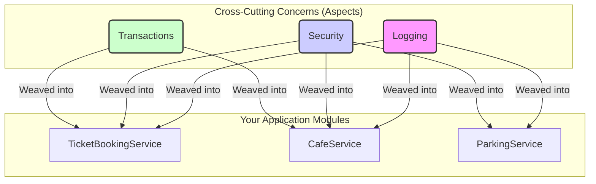

# 📜 1. AOP Introduction

Mawa, AOP (Aspect-Oriented Programming) gurinchi matladukundam. Deeni pani enti ante, mana code ni chala clean ga, maintainable ga unchadam. OOP (Object-Oriented Programming) ki idi oka add-on anuko.

### The Problem: Cross-Cutting Concerns

First, oka problem chuddam. Manam oka application develop chesetappudu, konni logic units chala different places lo repeat avtayi. For example, choodu:
- `TicketBookingService`
- `CafeService`
- `ParkingService`

Ee services anni vaati specific pani (business logic) chestayi. Kani, veeti annitiki konni common requirements untayi.

*   **Logging:** Prati method eppudu start ayindi, eppudu end ayindi ani log cheyali.
*   **Security:** Prati method call ki mundu user authentication check cheyali.
*   **Transactions:** Database operations start cheyadam, commit or rollback cheyadam.

Ee common requirements ni **"Cross-Cutting Concerns"** antaru. Endukante, ivi application antha cross ga (multiple modules lo) paakipoyi untayi.

### AOP Lekapothey Life Ela Untundi? (Without AOP)

AOP lekapothe, ee common logic antha manam prati method lo manually rayali. Choodu ila untadi:

```java
public class TicketBookingService {
    public void bookTicket() {
        //--- Cross-cutting logic START ---
        security.check();
        logger.log("bookTicket started...");
        transaction.begin();
        //---------------------------------

        // Asal Business Logic
        System.out.println("Ticket booked!");

        //--- Cross-cutting logic END ---
        transaction.commit();
        logger.log("bookTicket finished.");
        //-------------------------------
    }
}
```

**Deentlo unna problems enti?**
1.  **Code Duplication:** Logging, security code antha prati method lo repeat avtundi. Idi "Don't Repeat Yourself" (DRY) principle ki against.
2.  **Code Tangling:** Business logic (booking ticket) anedi cross-cutting logic tho kalisipoyi, chala messy ga untundi.
3.  **Maintenance Hell:** Repu logging format marchali ante, application lo unna prati method lo velli marchali. Idi chala pedda pani.

### AOP tho Solution Ela Untundi? (With AOP)

AOP ee problem ni solve chestundi. Deeni main goal enti ante, **cross-cutting concerns ni business logic nunchi separate cheyadam.**

*   **How?:** AOP lo, ee common logic antha manam oka separate module lo define chestam. Ee module ni **Aspect** antaru.
*   Tarvata, Spring AOP ee "Aspect" ni teskelli, runtime lo mana business methods ki apply chestundi. Ee process ni **Weaving** antaru.


Ee diagram lo choodu, Logging, Security anevi separate aspects ga unnayi. Mana business logic clean ga undi, AOP ee aspects ni automatic ga kaluputundi.

### Spring AOP Key Points

*   **AOP complements OOP:** OOP lo unit of modularity `class` aite, AOP lo adi `aspect`.
*   **AOP Implementation Styles:**
    *   `@AspectJ` **style:** Modern, annotation-based. Manam 99% ide use chestam.
    *   **Schema-based:** Old, XML-based. Legacy projects lo kanipistundi.
*   **Why learn AOP?:**
    *   Spring lo `@Transactional` lanti ready-made features vaadali anukunte, AOP basics teliste chalu.
    *   Kani nuvvu custom logic (performance monitoring, detailed logging) rayali anukunte, AOP pakka nerchukovali. **It's a pro skill.** 💪

---
### Mawa's Next Step
Okay, AOP ante ento oka idea vachindi. Ippudu "Aspect", "Weaving", "Join Point" lanti konni kottha padalu vachayi kada. Next enti ante, ee AOP terminology ni detail ga chuddam. Ready ga undu!
