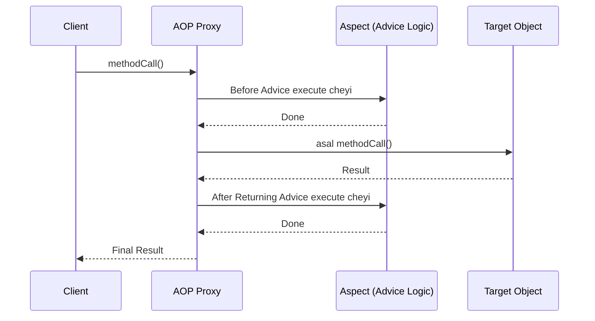

# 📜 2. AOP Concepts (AOP Terminology)

Mawa, last time AOP enduko chusam. Ippudu AOP prapancham lo manam vaade konni important "secret words" (terminology) nerchukundam. Choodu, idi careful ga chepta vinu, ee padalu oste AOP antha clear aipoddi.

### AOP Key Terms

1.  **Aspect**
    *   **Deeni pani enti ante:** cross-cutting concern logic ni oka chota pettadam. Idi oka simple class, daantlo manam advice, pointcuts lanti AOP constructs define chestam. Simple ga, manam raase logging or security logic antha ee class lone untundi.
    *   **Spring lo:** `@Aspect` annotation tho mark chesina class.

2.  **Join Point**
    *   **Deeni pani enti ante:** program execution lo oka specific point ni represent cheyadam. For example, oka method call cheyadam, or oka exception handle cheyadam. Ee points daggara manam AOP logic ni insert cheyochu.
    *   **Spring AOP lo:** Chala important, mawa. Spring AOP lo, join point ante **ALWAYS a method execution**. Verevi (like constructor or field access) Spring AOP support cheyadu.

3.  **Advice**
    *   **Deeni pani enti ante:** Aspect, oka particular join point daggara chese asal action (pani). Ante, manam raase cross-cutting logic eh ee advice.
    *   **Types of Advice:** Manaki 5 rakala advices unnayi, situation batti correct di vadali.
        *   `Before`: Target method call avvaka mundu ee logic execute avtundi.
        *   `After Returning`: Target method success ga complete ayi, result return chesaka ee logic execute avtundi.
        *   `After Throwing`: Target method lo edo exception vasthe, appudu ee logic execute avtundi.
        *   `After (Finally)`: Method success ayina, fail ayina, result tho sambandham lekunda, finally block laaga execute avtundi.
        *   `Around`: Idi chala powerful. Target method ki mundu, tarvata, full control teskuntundi. Manam ee advice nunchi target method ni call cheyochu, skip cheyochu, arguments marchochu, or return value ni kuda marchochu.

4.  **Pointcut**
    *   **Deeni pani enti ante:** Join points ni match cheyadam. Idi oka expression, or rule anuko. Ee rule, "Ee advice ni ekkada (at which join points) apply cheyali?" ani cheptundi.
    *   **Example:** "ee package lo unna anni `Service` classes lo `get*` tho start ayye methods ki matrame ee advice apply cheyi".

5.  **Target Object**
    *   **Deeni pani enti ante:** Idi asal business object (bean), deeni meeda manam AOP logic (advice) apply chestunnam. AOP framework ee object ni proxy chestundi.

6.  **AOP Proxy**
    *   **Deeni pani enti ante:** Target object ni wrap chesi, AOP logic ni add cheyadam. Spring container, target object ki బదులుగా ee proxy object ni create chestundi. Client call chesinappudu, ee proxy call ni intercept chesi, advice ni execute chesi, tarvata asal target object method ni call chestundi.
    *   **Types:** Spring lo rendu rakalu: JDK Dynamic Proxy and CGLIB Proxy.

7.  **Weaving**
    *   **Deeni pani enti ante:** Aspect ni target object tho link chesi, AOP proxy ni create chese process.
    *   **Spring lo:** Ee process antha **runtime** lo jarugutundi, ante application run ayyetappudu.

### Simple Flow Diagram

### Pro Tip 💡
Docs lo cheppinattu, "use the least powerful advice type that can implement the required behavior". Ante, `After Returning` tho pani aipothe, `Around` advice vadoddu. Endukante, `Around` advice lo `proceed()` call cheyadam marchipothe, asalaina method call avvadu! **Less power = less risk.**

---
### Mawa's Next Step
Okay, ee AOP terminology antha set. But asalu Spring AOP enduku, daani capabilities enti? Next, adi entha powerful oo chuddam.
