# AOP Concepts: Mana Secret Language! 🤫

Mawa, last time manam AOP ante ento high-level lo chusam. Ippudu, AOP prapancham lo manam vaade konni important "secret words" (terminology) nerchukundam. Ee padalu oste, AOP antha clear aipoddi. Ready aa? Let's decode this! 🕵️‍♂️

### Source URL
[https://docs.spring.io/spring-framework/reference/core/aop/introduction-defn.html](https://docs.spring.io/spring-framework/reference/core/aop/introduction-defn.html)

### The AOP Vocabulary 📖

Imagine manam oka restaurant ki vellam.
-   **You (The Customer):** You are the one who wants to perform an action (eat food).
-   **`Chef` (The Target Object):** The main person who does the core work (cooks the food).
-   **`Waiter` (The AOP Proxy):** The person who takes your order, talks to the chef, and brings you the food. He adds extra services around the chef's work.
-   **`Manager` (The Aspect):** The person who defines extra services like "logging every order" or "sanitizing hands before cooking". He is the cross-cutting concern.

Ee analogy tho, let's learn the real terms:

```mermaid
graph TD
    subgraph "AOP World 🌍"
        Target(Target Object - Chef 👨‍🍳)
        Proxy(AOP Proxy - Waiter 🤵)
        Aspect(Aspect - Manager 🧑‍💼)

        Proxy -- wraps --> Target
        Aspect -- defines rules for --> Proxy
    end
```



1.  **Aspect (The Manager 🧑‍💼):**
    *   **What it is:** Idi oka class, andulo manam cross-cutting concern logic (like logging, security) ni define chestam.
    *   **Analogy:** The Manager who decides, "Prati order ki bill generate cheyali" or "Prati customer ki welcome drink ivvali".
    *   **In Spring:** Usually a class annotated with `@Aspect`.

2.  **Join Point (A Moment in Time 🕒):**
    *   **What it is:** Program lo oka specific point, for example, a method call.
    *   **Analogy:** The moment the `Chef` starts cooking, or the moment he finishes. Ee specific moments ne join points antam.
    *   **In Spring AOP:** Spring lo, a join point is **ALWAYS** a method execution. Gurthu pettuko, mawa!

3.  **Advice (The Action 🎬):**
    *   **What it is:** The actual code/action that an aspect performs at a join point.
    *   **Analogy:** The Manager's actual instruction: "Log the order details to the system" (the action).
    *   **Types of Advice:** Manaki 5 rakala advices unnayi:
        *   **`Before`:** Method start avvakamunde run avtundi. (Chef vanta start cheyakamunde, hands wash chesko anadam).
        *   **`After Returning`:** Method successfully complete ayyaka run avtundi. (Chef vanta chesesaka, dish meeda garnish cheyadam).
        *   **`After Throwing`:** Method lo exception vasthe run avtundi. (Vanta chesetappudu edo padeste, kitchen clean cheyadam).
        *   **`After (Finally)`:** Method ela complete ayina (success or failure), run avtundi. (Chef shift aipoyaka, kitchen lights off cheyadam).
        *   **`Around`:** The most powerful one! Method ki mundu, tarvata kuda run avtundi. It can even decide not to call the method at all! (Manager vachi, "Ee dish vaddu, vere cheyi" ani cheppagalaru).

4.  **Pointcut (The "Where" Rule 🗺️):**
    *   **What it is:** Idi oka rule or expression that tells the advice **where** to run. It matches join points.
    *   **Analogy:** The Manager's rule: "Apply the 'billing' advice only for methods in the `CafeService` that start with `placeOrder`". Ee rule eh pointcut.
    *   **In Spring:** We use the AspectJ pointcut expression language to write these rules.

5.  **Target Object (The Hero 🦸‍♂️):**
    *   **What it is:** The actual bean/object whose methods we want to add advice to.
    *   **Analogy:** Mana `Chef`! The person doing the main work.

6.  **AOP Proxy (The Helper 🤵):**
    *   **What it is:** Spring create chese oka special object. Idi mana `Target Object` ni wrap chestundi. When we call a method on the proxy, it applies the advice and then calls the original method on the target.
    *   **Analogy:** Mana `Waiter`. Nuvvu direct ga chef tho matladavu, waiter tho matladatav. Waiter velli chef ki order cheppi, extra services (like getting water) chesi, food techi istadu.
    *   **In Spring:** This is either a JDK dynamic proxy or a CGLIB proxy.

7.  **Weaving (The Magic Stitching 🧵):**
    *   **What it is:** The process of linking the `Aspect` with the `Target Object` to create the final `AOP Proxy`.
    *   **Analogy:** The process of the Manager explaining the rules to the Waiter, so the Waiter can apply them when dealing with the Chef.
    *   **In Spring:** Spring does this at **runtime**.

Here's the complete flow in a diagram:


### Mawa's Pro Tip 💡
Docs lo cheppinattu, "use the least powerful advice type that can implement the required behavior". Ante, `After Returning` tho pani aipothe, `Around` advice vadoddu. Endukante, `Around` advice lo manam `proceed()` call cheyadam marchipothe, asalaina method call avvadu! Less power = less risk.

### How to Run This Section's Code
Ee section lo manam just concepts nerchukunnam and future examples kosam code structure set chesam. Ee code ni run chesi, setup correct ga undo ledo chuskovachu.
Project root `Spring-Project` folder lo undi, ee command run cheyi:
```bash
mvn compile exec:java -Dexec.mainClass="io.mawa.spring.core.aop.concepts.AopConceptsDemoApp"
```

### Mawa's Cliffhanger 🧗
Okay, ee secret language nerchukunnam. Kani Spring ki AOP gurinchi em telusu? Asalu Spring AOP enduku antha special? What are its goals and limitations? Next topic lo, manam Spring AOP capabilities ni explore cheddam. Let's see what our superpower can and cannot do! 💥
