# Spring AOP: Superpowers & Limits! 💥

Mawa, manam AOP anagane edo magic anukuntam. Kani prati superhero ki konni powers, konni limitations unnattu, mana Spring AOP ki kuda unnayi. Ee topic lo, manam Spring AOP em cheyagalado, em cheyaleno chuddam. Idi chala important mawa, endukante correct tool ni correct place lo vadali. Let's go! 🧐

### Source URL
[https://docs.spring.io/spring-framework/reference/core/aop/introduction-spring-defn.html](https://docs.spring.io/spring-framework/reference/core/aop/introduction-spring-defn.html)

### Spring AOP vs. AspectJ: The "Car Mechanic" Analogy 🚗🔧

Imagine AOP anedi car ni modify cheyadam anukundam.

*   **Spring AOP (The Authorized Service Center 🛠️):**
    *   Idi **pure Java** lo pani chestundi. Special tools (like a separate compiler) avasaram ledu.
    *   It only works on cars that are **managed by the Spring showroom** (i.e., Spring Beans). Bayata nunchi techina car (a non-Spring object) ni idi service cheyadu.
    *   It mainly focuses on modifying the car's **engine performance** (method execution). It doesn't change the color of the seats (field interception).
    *   The modifications are done **after the car is built and running** (runtime weaving).

*   **AspectJ (The Custom Mod Shop 🔥):**
    *   Idi inka powerful. It's like a full-blown custom modification garage.
    *   It needs **special tools** (its own compiler or a load-time weaver).
    *   It can work on **any car**, not just the ones from the Spring showroom (any Java object).
    *   It can modify anything - engine, seats, steering wheel (method execution, field interception, constructor execution, etc.).
    *   The modifications are done **during the car's manufacturing process** (compile-time or load-time weaving).

```mermaid
graph TD
    subgraph "Spring AOP (Authorized Service Center)"
        direction LR
        A[Pure Java ✨]
        B[Only for Spring Beans 📦]
        C[Only for Method Execution 📞]
        D[Runtime Weaving 🏃‍♂️]
    end

    subgraph "AspectJ (Custom Mod Shop)"
        direction LR
        W[Needs Special Compiler/Weaver ⚙️]
        X[For ANY Java Object 🚗]
        Y[Methods, Fields, Constructors... anything! 🛠️]
        Z[Compile/Load-time Weaving 🏭]
    end
```

### Key Takeaways from the Docs 📝

*   **Spring AOP is Pure Java:** Idi Spring AOP ki pedda balam. Manaki separate compilation step avasaram ledu. Everything happens within the normal JVM. Easy to use! ✅
*   **Focus on Spring Beans:** Spring AOP is designed to work seamlessly with the Spring IoC container. Its main purpose is to "advise" (add extra logic to) beans managed by Spring.
*   **Method Execution Only:** Mawa, idi chala important point. Spring AOP, by default, only supports method execution join points. Ante, manam oka method call ki mundu or tarvata matrame logic add cheyagalam. Manam oka class lo unna variable (field) access ni track cheyalem.
    *   **Gotcha!** Nuvvu field-level logic (like `auditing` who changed a `status` field) rayali anukunte, Spring AOP saripodu. Appudu manam **AspectJ** gurinchi alochinchali.
*   **Spring AOP is NOT a full replacement for AspectJ:** Spring AOP anedi AspectJ lo unna anni features ni provide cheyadu. Daaniki బదులుగా, Spring AOP provides a simple, well-integrated solution for the most common problems (80% use cases) in enterprise applications.
*   **Best of Both Worlds:** Manam isthe, Spring ni AspectJ tho integrate cheyochu, appudu manaki rendu frameworks lo unna power vastundi. But for most cases, Spring AOP is more than enough.

### So, When to Use What?

*   **90% of the time, Spring AOP is your best friend.** For logging, security, and transactions on your service layer beans, it's perfect.
*   If you need to advise objects outside the Spring container, or if you need to intercept field access or constructor execution, then you need the big gun: **AspectJ**.

### Mawa's Cliffhanger 🧗
Sare, Spring AOP anedi "runtime" lo magic chestundi ani cheppukunnam kada. Asalu aa magic enti? How does it work internally without a special compiler? The answer lies in a concept called **"Proxies"**. In our next topic, we'll uncover the secrets of how Spring creates these magical proxy objects. Get ready to peek behind the curtain! 🎭
