# 📜 3. Spring AOP vs. AspectJ

Mawa, AOP implement cheyadaniki Spring AOP okate kaadu, AspectJ ane inko popular framework undi. Rendu veru veru, vaati madhya unna main differences teluskovadam chala important. Appude manam correct tool ni correct situation lo vadagalam. Choodu, careful ga chepta vinu.

### Spring AOP Capabilities

*   **Pure Java:** Deeni biggest advantage enti ante, idi 100% pure Java. Manaki separate compiler or special build steps em avasaram ledu. Normal Java project laage run cheyochu.
*   **Runtime Weaving:** Spring AOP, weaving process ni (ante, aspect logic ni target object tho link cheyadam) application run ayyetappudu, runtime lo chestundi.
*   **Only for Spring Beans:** Chala important point mawa, Spring AOP kevalam Spring container manage chese beans ki matrame AOP apply cheyagaladu. Nuvvu `new` keyword tho create chesina normal Java object ni advise cheyalem.
*   **Method Execution Only:** Inko chala important point. Spring AOP **only method execution join points** ni matrame support chestundi. Ante, manam methods ki matrame advice (extra logic) add cheyagalam. Class fields (variables) access chesinappudu or constructors call ayinappudu logic add cheyalem.

### AspectJ Capabilities

*   **More Powerful:** Idi complete AOP framework. Chala advanced features untayi.
*   **Special Compiler/Weaver:** AspectJ vaadali ante, daaniki unna special compiler (ajc) or a "load-time weaver" avasaram. Idi build process ni konchem complex chestundi.
*   **For Any Java Object:** Spring beans eh kaadu, ఏ Java object ki ayina advice apply cheyochu.
*   **All Join Points:** Method execution, field access (`get`/`set`), constructor calls... anni rakala join points ni support chestundi.
*   **Compile/Load-time Weaving:** Weaving anedi code compile ayyetappude or class load ayyetappude jarugutundi. Runtime performance konchem better ga untundi.

### Key Differences at a Glance

```mermaid
graph TD
    subgraph "Spring AOP"
        direction LR
        A[Pure Java ✨]
        B[Only for Spring Beans 📦]
        C[Only for Method Execution 📞]
        D[Runtime Weaving 🏃‍♂️]
    end

    subgraph "AspectJ"
        direction LR
        W[Needs Special Compiler/Weaver ⚙️]
        X[For ANY Java Object 🚗]
        Y[Methods, Fields, Constructors... anything! 🛠️]
        Z[Compile/Load-time Weaving 🏭]
    end
```

### Ekkada Edi Vaadali? (When to use What?)

*   **Spring AOP:** 90% of the time, idi saripotundi. Spring applications lo logging, security, transactions lanti common tasks ki idi perfect. Simple, easy, and powerful enough.
*   **AspectJ:** Neeku Spring manage cheyani objects ni advise cheyalanna, or field access lanti advanced features kavalanna, appudu AspectJ vaadali.

---
### Mawa's Next Step

Okay, Spring AOP runtime lo "weaving" chestundi anukunnam. Asal aa magic ela chestundi? The secret is **Proxies**. Next topic lo, Spring ee proxy objects ni ela create chestundo, daani gurinchi chuddam.
