# AOP Proxies: The Magician's Secret Revealed! 🎩✨

Mawa, manam last time AOP antha runtime lo jarugutundi ani cheppukunnam. Kani *ela*? The secret ingredient is **Proxies**. Spring AOP antha ee proxy-based mechanism meeda ne nadustundi. Idi ardam cheskovadam chala important, so konchem extra concentration pettu, mawa! Just a little bit, and you'll get this forever! 💪

### Source URL
[https://docs.spring.io/spring-framework/reference/core/aop/introduction-proxies.html](https://docs.spring.io/spring-framework/reference/core/aop/introduction-proxies.html)

### What is a Proxy? The "Bodyguard" Analogy 🕴️

Imagine oka VIP (`Target Object`) unnadu. Security kosam, manam VIP ni direct ga access cheyanivvamu. Instead, manam oka `Bodyguard` (the **Proxy**) ni pedatam.
-   Nuvvu VIP tho matladali ante, mundu Bodyguard tho matladali.
-   Bodyguard nee request ni check chesi (`Before Advice`), VIP ki pass chestadu.
-   VIP response ni Bodyguard teskuni, neeku ichestadu (`After Advice`).

Ee Bodyguard ye mana AOP Proxy! It wraps the original object and adds extra behavior.


### The Two Types of Bodyguards (Proxies) in Spring

Spring lo ee "Bodyguard" pani cheyadaniki rendu rakala proxies unnayi. Spring ye automatically correct bodyguard ni select cheskuntundi.

1.  **JDK Dynamic Proxies (The "By-the-Book" Bodyguard 📜):**
    *   **Rule:** Ee bodyguard kevalam oka `official rulebook` (Java **Interface**) unna VIPs ki matrame pani chestadu.
    *   **How it works:** If your target object (`CashPaymentService`) implements an interface (`PaymentService`), Spring by default uses a JDK Dynamic Proxy.
    *   **Advantage:** Idi Java lo built-in feature, so chala standard and reliable.
    *   **This is the default and preferred way!** Anduke, "program to an interface, not an implementation" ane rule antha important.

2.  **CGLIB Proxies (The "Street-Smart" Bodyguard 🕶️):**
    *   **Rule:** Okavela VIP ki official rulebook (Interface) lekapoyina, ee bodyguard pani cheyagaladu. He works directly with the VIP's class.
    *   **How it works:** If your target object is a class that **does not implement any interface**, Spring has no choice but to use a CGLIB proxy. CGLIB stands for "Code Generation Library". It dynamically creates a *subclass* of your target object at runtime to add the advice.
    *   **When to use:**
        *   Nee bean ki interface lekapothe.
        *   Nuvvu oka specific method ni advise cheyali anukuni, aa method interface lo lekapothe. (This is a rare case, and maybe a sign of bad design).
    *   **Gotcha!** CGLIB proxies work by creating a subclass. Ante, `final` methods or `final` classes ni CGLIB proxy cheyaledu!

### The Big Picture: How Spring Decides

```mermaid
graph TD
    A[Does your bean implement an interface?] -->|Yes ✅| B(Use JDK Dynamic Proxy);
    A -->|No ❌| C(Use CGLIB Proxy);

    B --> D{Your advised bean is ready!};
    C --> D;

    subgraph "Best Practice"
        direction LR
        B
    end
```



> **Interview Tip:** Interviewer adugutadu, "How does Spring AOP work internally?". Your answer should be: "Spring AOP is proxy-based. It uses JDK dynamic proxies by default if the target bean implements an interface. If not, it falls back to using CGLIB proxies to create a subclass of the target at runtime." Ee answer isthe, they will be impressed! 💯

### How to Run This Section's Code
Ee section lo unna code ni run chesi, Spring ela different proxies create chestundo chudu.
Project root `Spring-Project` folder lo undi, ee command run cheyi:
```bash
mvn compile exec:java -Dexec.mainClass="io.mawa.spring.core.aop.proxies.AopProxyDemoApp"
```
Output lo proxy class names ni observe cheyi. Okati JDK proxy, inkokati CGLIB proxy untundi!

### Mawa's Cliffhanger 🧗
Sare, manam ippudu `@AspectJ` annotations gurinchi matladadaniki siddham ga unnam. Asalu ee annotations (`@Aspect`, `@Before`, `@After`, etc.) ento, vatini ela use cheyalo, and asalu Spring ki ee annotations unnayi ani ela telustundo... next topic lo chuddam. It's time to write some real AOP code! 🔥
