# 📜 4. AOP Proxies

Mawa, manam last time Spring AOP runtime lo "weaving" chestundi ani cheppukunnam. Asal aa magic ela chestundi? The secret ingredient is **Proxies**. Spring AOP antha ee proxy-based mechanism meeda ne nadustundi. Idi ardam cheskovadam chala important, so konchem extra concentration pettu.

### Proxy ante enti?

Choodu mawa, simple ga cheptanu. Oka proxy anedi mana asal `target` object (ante, mana business service bean) ki oka wrapper or cover anuko. Application lo vere objects, mana service ni direct ga call cheyakunda, ee proxy ni call chestayi.

Deeni pani enti ante, aa call ni madhyalo pattukuni (intercept chesi), manam define chesina extra logic (advice) ni execute cheyadam. Aa tarvata, adi asal target method ni call chestundi.

### Spring lo Two Types of Proxies

Spring, ee proxy ni create cheyadaniki, situation batti, ee rendu techniques lo okati automatically select cheskuntundi.

1.  **JDK Dynamic Proxies**
    *   **Idi eppudu select avtundi?:** Chala simple. Mana target bean oka **interface** ni implement chestunte, Spring by default idi use chestundi. For example, `PaymentService` ane interface ni `CashPaymentService` implement cheste.
    *   **Ela pani chestundi?:** Idi Java lo unna built-in feature. Spring, runtime lo aa `PaymentService` interface ki oka brand-new implementation class ni create chestundi. Ee kottha class eh mana proxy.
    *   **Note:** Idi default and Spring recommend chese approach. Anduke "program to an interface, not an implementation" ane principle antha important.

2.  **CGLIB Proxies**
    *   **Idi eppudu select avtundi?:** Okavela mana target bean ki **interface lekapothe**, Spring ki inko option leka, idi use chestundi.
    *   **Ela pani chestundi?:** CGLIB (Code Generation Library) anedi oka powerful 3rd party library. Idi direct ga mana target class ki oka **subclass** ni runtime lo create chestundi. Aa subclass, parent (target) methods ni override chesi, advice ni add chestundi.
    *   **Important Limitation:** CGLIB subclassing meeda depend avtundi kabatti, `final` classes or `final` methods ni proxy (override) cheyaledu. So, AOP vaade classes lo `final` keyword tho jagratha ga undali.

### Spring ela decide chestundi?

```mermaid
graph TD
    A{Target bean ki interface unda?} -->|Yes ✅| B[Use JDK Dynamic Proxy];
    A -->|No ❌| C[Use CGLIB Proxy];
```

> **Interview Tip:** "How does Spring AOP work internally?" ani adigithe, ee answer pakka cheppu: "Spring AOP is proxy-based. By default, it uses JDK dynamic proxies for interface-based beans. If a bean doesn't implement an interface, it falls back to CGLIB proxies, which create a subclass of the target bean at runtime to weave in the advice."

---
### Mawa's Next Step
Okay, ee proxy concept ardamaindi. Ippudu manam asal AOP code rayadaniki ready. `@AspectJ` annotations (`@Aspect`, `@Before`, `@After`, etc.) gurinchi, and vatini ela use cheyalo next chuddam. Time for real code!
