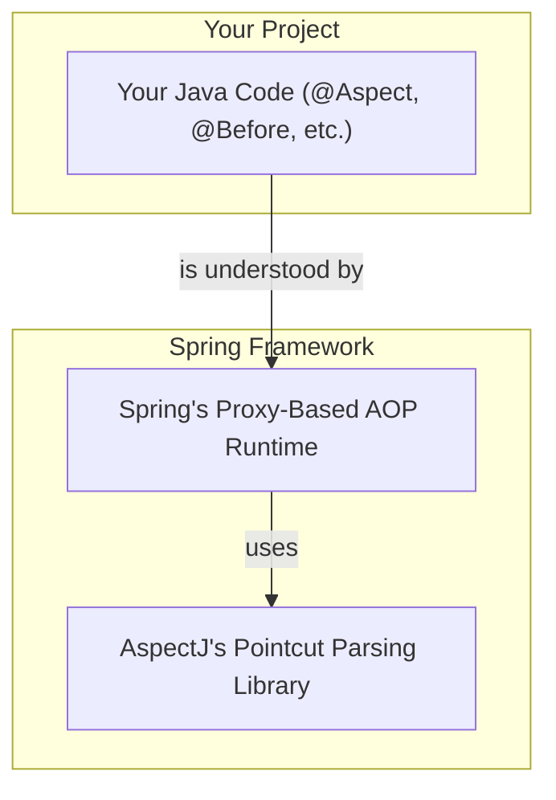

# @AspectJ Support: The Modern Way to AOP! 🚀

Mawa, manam ippudu AOP lo asalaina magic loki enter avuthunnam. Ippati varaku theory chusam, ippudu practicals start! `@AspectJ` anedi AOP ni implement cheyadaniki modern, annotation-based, and most popular way. Idi chala clean ga, easy ga untundi. Let's get our hands dirty! 💻

### Source URL
[https://docs.spring.io/spring-framework/reference/core/aop/ataspectj.html](https://docs.spring.io/spring-framework/reference/core/aop/ataspectj.html)

### What is @AspectJ Style? 🤔

Simple ga cheppali ante, idi oka "style" of writing aspects.
*   **Regular Java Classes:** Manam normal Java classes eh rastam. No special files, no XML (mostly).
*   **Annotations:** Manam `@Aspect`, `@Before`, `@After`, etc., lanti annotations tho mana class ki AOP powers istam.
*   **Inspired by AspectJ:** Ee style ni first [AspectJ](https://www.eclipse.org/aspectj/) project introduce chesindi. Spring aa style ni adopt cheskundi.

### Spring AOP + AspectJ = The Perfect Match ❤️

Mawa, ikkada oka important point undi. Manam `@AspectJ` annotations vadutunnam ante, manam full AspectJ framework vadutunnam ani kaadu.
*   **Spring uses AspectJ's library:** Spring, AspectJ create chesina oka library ni matrame vadukuntundi. Enduku? To understand the pointcut expressions (aa "where" rules manam last time chusinaవి).
*   **Runtime is Pure Spring AOP:** But the actual AOP magic (creating proxies, weaving) antha Spring AOP ye chuskuntundi.
*   **No Special Compiler Needed:** Anduke, manaki AspectJ compiler or weaver lanti special tools em avasaram ledu. Mana normal Java code, normal JVM, anthe! 😎

> **In short:** Spring took the best part of AspectJ (the easy annotation style and powerful pointcut language) and integrated it into its own, simpler, proxy-based AOP framework.



### What's Coming Up in this Chapter?

Ee `@AspectJ` journey lo, manam ee topics cover cheyabothunnam:
1.  **Enabling @AspectJ Support:** Asalu Spring ki, "Hey, nenu @AspectJ annotations vadutunna, chusko!" ani ela cheppali?
2.  **Declaring an Aspect:** Oka normal class ni `@Aspect` tho oka powerful aspect ga ela marchali?
3.  **Declaring a Pointcut:** Mana "where" rules (`@Pointcut`) ni ela rayali?
4.  **Declaring Advice:** Mana "what" and "when" logic (`@Before`, `@After`, `@Around`, etc.) ni ela implement cheyali?
5.  **Introductions:** Existing classes ki kottha methods ni on-the-fly ela add cheyali?
6.  **Aspect Instantiation Models:** Mana Aspect object ni Spring ela create chestundi? (Singleton aa, prototype aa?)
7.  **A Full AOP Example:** Anni concepts ni kalipi, ఒక complete example chuddam.

### How to Run This Section's Code
Ee section lo manam just concepts nerchukunnam and future examples kosam code structure set chesam. Ee code ni run chesi, setup correct ga undo ledo chuskovachu.
Project root `Spring-Project` folder lo undi, ee command run cheyi:
```bash
mvn compile exec:java -Dexec.mainClass="io.mawa.spring.core.aop.aspectj.AspectJSupportDemoApp"
```

### Mawa's Cliffhanger 🧗
Okay, theory antha set. But how do we flip the switch? How do we tell our Spring application, "It's time for AOP!"? There's one magic annotation that brings everything to life. Ready to discover it? Let's move to our very first step: Enabling @AspectJ Support! 🚀
