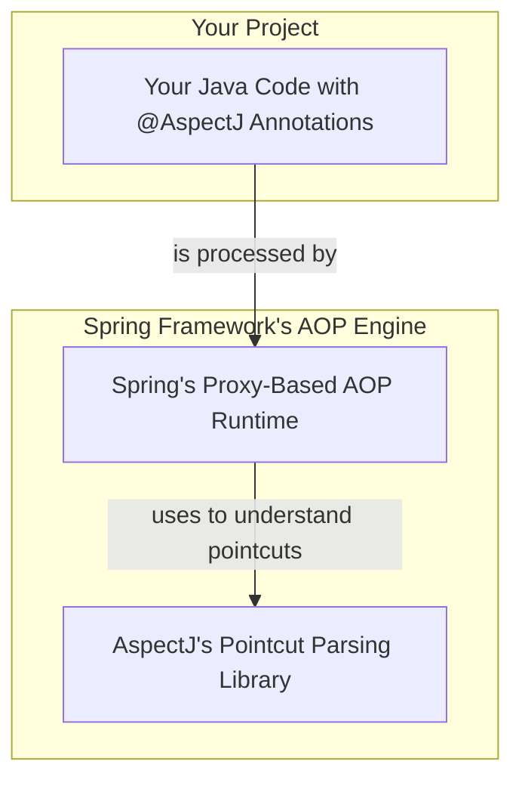

# 📜 5. @AspectJ Support Overview

Mawa, ippudu manam AOP ni asal code lo ela rayalo chuddam. Ippati varaku theory chusam, ippudu practicals start! Spring lo AOP rayadaniki the most popular and modern way enti ante, `@AspectJ` annotations use cheyadam.

### @AspectJ Style ante enti?

Chala simple mawa. Idi AOP logic ni rayadaniki oka "style" anuko.
*   **Regular Java Classes:** Manam AOP logic antha normal Java classes (POJOs) lone rastam.
*   **Annotations:** Manam `@Aspect`, `@Pointcut`, `@Before` lanti special annotations tho aa class ki AOP powers istam.

### The Spring AOP & AspectJ Relationship

Mawa, ikkada chala mandi confuse avtaru. "Manam @AspectJ annotations vadutunnam ante, full AspectJ framework ni vadutunnama?" ani. The answer is **NO**. Choodu, careful ga chepta vinu.

*   **What Spring Uses:** Spring, **AspectJ create chesina oka library ni matrame** vadukuntundi. Deeni pani enti ante, manam rase `@Pointcut` expressions ni parse chesi, ardam cheskovadam. AspectJ pointcut language chala powerful, so Spring daaniకోసం ee library ni use chestundi.
*   **What Spring Does:** But, asal AOP magic, ante proxy objects ni create cheyadam, advice ni weave cheyadam... ee panulantha **pure Spring AOP framework** eh chuskuntundi.
*   **The Result:** Manaki AspectJ lanti powerful pointcuts rayagalige sakti vastundi, kani AspectJ laaga special compiler or weaver lanti extra tools avasaram ledu. It's the best of both worlds!

### What's Coming Up in this Chapter?

Ee `@AspectJ` journey lo, manam ee topics ni step-by-step ga cover cheyabothunnam:
1.  **Enabling @AspectJ Support:** Asal AOP ni activate cheyadaniki aa "switch" enti?
2.  **Declaring an Aspect:** Oka normal class ni `@Aspect` tho oka powerful aspect ga ela marchali?
3.  **Declaring a Pointcut:** Mana "where" rules (`@Pointcut`) ni ela rayali?
4.  **Declaring Advice:** Mana "what" and "when" logic (`@Before`, `@After`, `@Around`, etc.) ni ela implement cheyali?
5.  **Introductions:** Existing classes ki kottha methods ni on-the-fly ela add cheyali? (oka cool feature!)
6.  **A Full AOP Example:** Anni concepts ni kalipi, ఒక complete, working example chuddam.

---
### Mawa's Next Step
Okay, theory antha set. But how do we flip that switch? How do we tell our Spring application, "It's time for AOP!"? There's one magic annotation that brings everything to life. Ready to discover it? Let's move to our very first step: Enabling @AspectJ Support! 🚀
