# Enabling @AspectJ: Flipping the Magic Switch! 开关

Mawa, manam AOP concepts nerchukunnam, proxies ela pani chestayo chusam. But asalu ee AOP magic ni mana Spring application lo **activate** cheyadam ela? Adi chala simple, just oka switch on chesinantha easy! Aa switch eh `@EnableAspectJAutoProxy` annotation.

### Source URL
[https://docs.spring.io/spring-framework/reference/core/aop/ataspectj/aspectj-support.html](https://docs.spring.io/spring-framework/reference/core/aop/ataspectj/aspectj-support.html)

### The Two Prerequisites 📋

Spring tho AOP pani cheyali ante, manaki rendu vishayalu kavali:

1.  **The `aspectjweaver` Library:**
    *   Idi oka `.jar` file, mawa. Mana project `pom.xml` lo ee dependency undali.
    *   Manam `spring-boot-starter-aop` add chesinappudu, idi automatically vachestundi. So, no need to worry. But interview lo "What do you need to enable AspectJ support?" ani adigithe, idi cheppali.
    *   **Why?** Spring ee library ni `@Pointcut` expressions ni parse cheyadaniki vadutundi.

2.  **The Magic Annotation:**
    *   **In Java Config:** Mana `@Configuration` class meeda, manam `@EnableAspectJAutoProxy` ani rayali.
    *   **In XML Config:** `<aop:aspectj-autoproxy/>` ane tag ni pettali.

> **That's it!** Ee okka annotation tho, Spring automatic ga `@Aspect` annotated beans ni detect chesi, proxies create cheyadam start chestundi.

### How it Works Behind the Scenes 🎬

`@EnableAspectJAutoProxy` annotation chudagane, Spring container lo konni special beans register avutayi. Ee beans (like `AnnotationAwareAspectJAutoProxyCreator`) mana application lo unna anni beans ni scan chestayi.

```mermaid
graph TD
    A["Your @Configuration class"] -- has --> B["@EnableAspectJAutoProxy 🚀"];
    B -- tells Spring --> C{Hey, scan for @Aspect beans!};
    C -- finds --> D["Your @Aspect class (e.g., LoggingAspect)"];
    D -- and its pointcuts --> E{Find all beans that need advice};
    E -- creates --> F["AOP Proxies for those beans"];
```



Ee annotation lekunda, nuvvu enni `@Aspect` classes rasina, Spring pattinchukodu. They will just be normal beans. So, **never forget this annotation!**

### Code Reference

Mana `AopProxyDemoApp.java` lo ee annotation ni already add chesam. You can see it at the top of the class.

```java
// From io.mawa.spring.core.aop.proxies.AopProxyDemoApp.java

@Configuration
@ComponentScan
@EnableAspectJAutoProxy // <-- IKKADA CHUDU MAWA! THE MAGIC SWITCH!
public class AopProxyDemoApp {
    // ...
}
```

### How to Run This Section's Code
Ee concept ni chudadaniki, manam `AopProxyDemoApp` lo `@EnableAspectJAutoProxy` annotation ni enable chesam. Ee code ni run chesi, AOP activate ayyindo ledo confirm cheskovachu.
Project root `Spring-Project` folder lo undi, ee command run cheyi:
```bash
mvn compile exec:java -Dexec.mainClass="io.mawa.spring.core.aop.proxies.AopProxyDemoApp"
```
The output will be the same as before, but now we know *why* it's working!

### Mawa's Cliffhanger 🧗
Switch on chesam! Ippudu manaki AOP power vachindi. Mari mana first "Manager" (`@Aspect` class) ni ela create cheyali? How do we write a class that contains our cross-cutting logic? Next topic lo, manam mana modati aspect ni declare cheddam. Let's build our first AOP bodyguard! 🕴️
