# 📜 6. Enabling @AspectJ Support

Mawa, manam AOP concepts nerchukunnam, ippudu AOP magic ni mana Spring application lo **activate** cheyadam ela? Choodu, idi chala simple, just oka switch on chesinantha easy. Aa switch eh `@EnableAspectJAutoProxy` annotation.

### How to Enable @AspectJ Support

Spring ki "Nenu @AspectJ annotations vadutunna, so AOP ni enable cheyi" ani cheppadaniki, manaki rendu ways unnayi.

1.  **Java Configuration (The Modern Way)**
    *   **Deeni pani enti ante:** Mana `@Configuration` class meeda `@EnableAspectJAutoProxy` ane annotation ni add cheyadam. Anthe! Ee okka annotation tho Spring AOP antha activate aipoddi.
    *   **Example:**
        ```java
        @Configuration
        @EnableAspectJAutoProxy // <-- Ee okka line chaalu, mawa! The magic switch!
        public class AppConfig {
            // ... your other bean definitions
        }
        ```

2.  **XML Configuration (The Old Way)**
    *   Okavela nuvvu XML-based configuration vadutunte, nee XML file lo `<aop:aspectj-autoproxy/>` ane tag add cheyali.
    *   **Example:**
        ```xml
        <beans ...>
            <aop:aspectj-autoproxy/>
            <!-- your other beans -->
        </beans>
        ```

### Behind the Scenes: What does this annotation do?

Ee annotation chudagane, Spring container lo konni special beans register avutayi. Deentlo ముఖ్యమైనది (the most important one is) `AnnotationAwareAspectJAutoProxyCreator`.

Deeni pani enti ante, idi mana application context lo unna anni beans ni scan chesi, `@Aspect` annotation unna beans ni vethukutundi (finds them). Appudu, aa aspects lo unna pointcuts ఆధారంగా (based on the pointcuts), Spring decides which other beans need to be proxied.

```mermaid
graph TD
    A["Your @Configuration class"] -- has --> B["@EnableAspectJAutoProxy 🚀"];
    B -- tells Spring --> C{Register `AnnotationAwareAspectJAutoProxyCreator`};
    C -- starts scanning beans --> D["Finds your `@Aspect` class"];
    D -- and its pointcuts --> E{Finds all target beans to be advised};
    E -- creates --> F["AOP Proxies for those target beans"];
```



**Important:** Ee annotation lekunda, nuvvu enni `@Aspect` classes rasina, Spring vaatini pattinchukodu. They will just be treated as normal beans without any AOP powers. **So, never forget this annotation!**

---
### Mawa's Next Step
Switch on chesam! Ippudu AOP power mana chetilo undi. Mari mana first `@Aspect` class ni ela create cheyali? How do we write a class that contains our cross-cutting logic? Next topic lo, manam mana modati aspect ni declare cheddam.
