# 📜 7. Declaring an Aspect

Mawa, AOP switch on chesam kada, ippudu AOP lo main building block, mana modati **Aspect** ni ela create cheyalo chuddam.

### How to Declare an Aspect?

Chala simple. Deeni pani enti ante, oka normal Java class (POJO) ni teskuni, daani meeda `@Aspect` annotation pettadame. Anthe! Aa class ippudu oka Aspect ga maripoindi.

```java
import org.aspectj.lang.annotation.Aspect;

@Aspect // <-- Ee annotation tho, idi oka Aspect ani Spring ki telustundi.
public class MyFirstAspect {
    // Ikkada manam Advice, Pointcuts lanti magic stuff rastam.
    // Ee class lo normal methods, variables kuda undochu.
}
```

### How Does Spring Find Our Aspect?

Okay, manam class ni `@Aspect` ani mark chesam. Kani asalu ee class undi ani Spring ki ela telustundi? Choodu, an aspect is also a Spring bean. So, manam daanni Spring container lo register cheyali, just like any other bean.

Three ways unnayi:

1.  **Component Scanning (The Best Way):**
    *   Idi manam 99% use chese modern method.
    *   **⚠️ SUPER IMPORTANT:** Just `@Aspect` annotation pedithe, Spring daanni component scanning lo pick cheskodu. You **must** also add a stereotype annotation like `@Component`, `@Service`, etc.
    *   So, rule enti ante, `@Component` annotation tho daanni oka bean ga mark cheyi, and `@Aspect` annotation tho adi oka aspect ani cheppu. Rendu undali.

    ```java
    @Aspect
    @Component // <-- Ee rendu undali, marchipoku!
    public class LoggingAspect { ... }
    ```

2.  **Java Config (`@Bean` method):**
    *   Manam `@Configuration` class lo, `@Bean` method ద్వారా kuda aspect ni manually declare cheyochu.

    ```java
    @Configuration
    public class AppConfig {
        @Bean
        public MyFirstAspect myAspect() {
            return new MyFirstAspect();
        }
    }
    ```

3.  **XML Config (The Old Way):**
    *   XML configuration lo `<bean>` tag tho kuda define cheyochu.

### How Spring Processes Aspects

```mermaid
graph TD
    A[Spring Container Starts 🚀] --> B{Scans for components};
    B --> C{Finds a class with @Component};
    C --> D[Creates a bean instance];
    D --> E{Checks for @Aspect annotation};
    E -- Yes --> F[✅ Recognizes as Aspect & processes it for AOP];
    E -- No --> G[❌ Treats as a regular bean];
```



### Important Rule: Aspects cannot advise other Aspects

*   Mawa, idi gurthu pettuko. Spring AOP lo, oka aspect ni inko aspect tho advise cheyalem.
*   Endukante, `@Aspect` annotation chudagane, Spring aa bean ni auto-proxying nunchi exclude chestundi. Deeni valla, "Aspect A advises Aspect B, and Aspect B advises Aspect A" lanti infinite loops anevi ravu.

---
### Mawa's Next Step
Okay, aspect declare cheyadam vachesindi. But ee aspect ekkada, eppudu, em cheyalo manam inka cheppaledu. Next, manam "WHERE" ni define cheddam. Ante, **Pointcuts** gurinchi matladukundam.
