# 📜 7. Declaring an Aspect (Aspect ని ప్రకటించడం)

Hey Mawa! Ready to create our first-ever Aspect? Let's go! 🚀

So, మనం AOP gurinchi, daani concepts gurinchi aalochincham. Ippudu practical ga "Aspect" ni ela create cheyalo chuddam. It's surprisingly simple, mawa!

#### 🤔 How to Declare an Aspect? (Aspect ni ela cheppali?)

Spring ki, "Eyy, idi naa Aspect, deeni meedha oka look eyyi!" ani cheppadaniki, manam oka simple annotation వాడతాం.

*   **The Magic Annotation is `@Aspect`!** ✨
    *   You just take a plain Java class (POJO - Plain Old Java Object) and put the `@Aspect` annotation on top of it. Anthe! Spring will now recognize this class as a special "Aspect" class.
    *   Think of it like putting a "Director" 🎬 badge on a person in a film crew. Everyone now knows their special role.

```java
import org.aspectj.lang.annotation.Aspect;

@Aspect // <--- Ee annotation tho, Spring recognize chesthundi!
public class MyFirstAspect {
    // Ikkada manam Advice, Pointcuts lanti magic stuff rastham
}
```

#### 🧠 How Does Spring Find Our Aspect? (Spring ki mana Aspect ela dorukuthundi?)

Okay, manam class ki `@Aspect` badge vesaam. But how does the Spring container even know this class exists? Just like any other bean, mawa!

Spring needs to manage our Aspect class as a bean in its container. Manam idi 3 ways lo cheyochu:

1.  **Component Scanning (మనకి ఇష్టమైన పద్ధతి):**
    *   This is the most common and modern way.
    *   **⚠️ SUPER IMPORTANT:** Just putting `@Aspect` is **NOT** enough for component scanning. You need to **also** add a stereotype annotation like `@Component`.
    *   So, the class needs **both** `@Aspect` and `@Component`. `@Component` tells Spring, "Hey, create a bean of this class," and `@Aspect` tells Spring, "Oh, and by the way, this bean is an Aspect!"
    *   It's like saying, "This person is an `Employee` (`@Component`) and their role is `Director` (`@Aspect`)."

    ```java
    import org.aspectj.lang.annotation.Aspect;
    import org.springframework.stereotype.Component;

    @Aspect
    @Component // <-- Idi marchipoku mawa! Very important for scanning!
    public class LoggingAspect {
        // ...
    }
    ```

2.  **Java-based Configuration (`@Bean` method):**
    *   You can manually declare it as a bean in your `@Configuration` class.

    ```java
    @Configuration
    public class AppConfig {
        @Bean
        public MyFirstAspect myAspect() {
            return new MyFirstAspect();
        }
    }
    ```

3.  **XML Configuration (Old school):**
    *   The classic XML way.

    ```xml
    <bean id="myAspect" class="com.example.MyFirstAspect" />
    ```

#### 🤯 One Aspect Cannot Advise Another! (ఒక Aspect ఇంకో Aspect ని మార్చలేదు!)

This is a key rule, mawa. A "Gotcha!" moment.

*   In Spring AOP, an Aspect **cannot** be the target of advice from another Aspect.
*   Ante, oka director ఇంకో director పనిలో వేలు పెట్టలేడు అన్నమాట.
*   The `@Aspect` annotation itself tells Spring to exclude this bean from being auto-proxied. This is a smart move to prevent crazy infinite loops! (Imagine Aspect A advises Aspect B, and Aspect B advises Aspect A... boom! 💥).

#### Diagram Time! 📊

Let's visualize how Spring identifies an Aspect.

```mermaid
graph TD
    A[Spring Container Starts 🚀] --> B{Scans for components};
    B --> C{Finds a class with @Component};
    C --> D[Creates a bean instance];
    D --> E{Checks for @Aspect annotation};
    E -- Yes --> F[✅ Recognizes as Aspect];
    E -- No --> G[❌ Treats as a regular bean];
    F --> H[Uses it to weave advice into other beans];

    subgraph "Class Definition"
        direction LR
        I["@Aspect"]
        J["@Component"]
        K["class LoggingAspect {...}"]
        I -- and --> J -- annotates --> K
    end

    B --> I;
```



That's it, mawa! Declaring an aspect is just about tagging a regular Spring bean with `@Aspect`. The real fun begins when we add *Advice* and *Pointcuts* to it, which is coming up next! 😉
