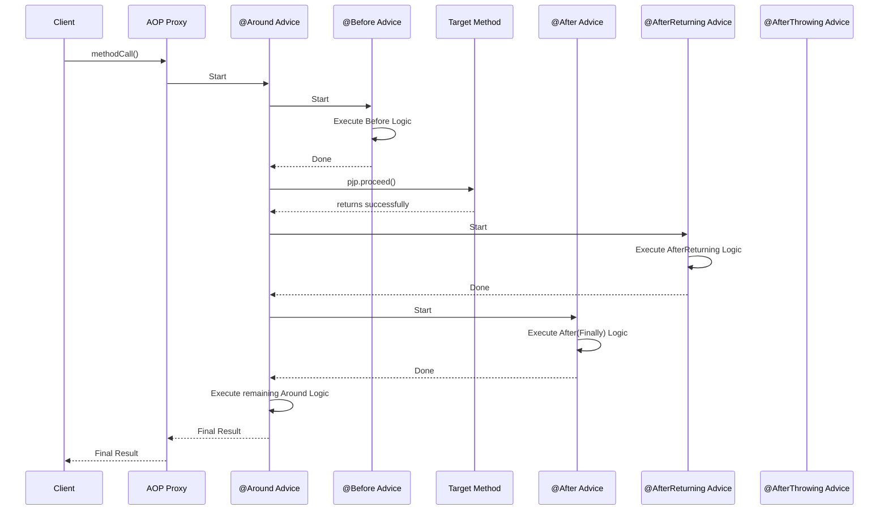

# 📜 9. Declaring Advice

Mawa, manam ippati varaku Aspect (WHO), Pointcut (WHERE) gurinchi matladukunnam. Ippudu asalaina part ki vacham: **Advice** (WHAT & WHEN). Advice ante, mana aspect asal em pani cheyali, and eppudu cheyalo define cheyadam. This is where we write the actual logic.

### Types of Advice

Manaki 5 rakala advices unnayi. Vaatini annotations tho define chestam.

1.  `@Before`
    *   **Deeni pani enti ante:** Target method execute avvaka mundu ee advice logic run avtundi.
    *   **Use case:** Pre-checks cheyadaniki, like security validation or logging the method entry.
    *   **Important:** Ee advice, target method execution ni aapa ledu (cannot prevent).

2.  `@AfterReturning`
    *   **Deeni pani enti ante:** Target method crash avvakunda, success ga complete ayi, oka value ni return chesaka ee logic run avtundi.
    *   **Use case:** Method return chesina result ni log cheyadaniki or modify cheyadaniki (kani vere object ni return cheyalem).
    *   **`returning` attribute:** Ee attribute tho, manam return value ni advice method lo access cheyochu.

3.  `@AfterThrowing`
    *   **Deeni pani enti ante:** Okavela target method lo edo exception vachi, adi crash aite, appudu ee logic run avtundi.
    *   **Use case:** Error logging, alert systems ni trigger cheyadam, or specific exception handling.
    *   **`throwing` attribute:** Ee attribute tho, manam throw ayina exception object ni advice method lo access cheyochu.

4.  `@After`
    *   **Deeni pani enti ante:** Target method success ayina, fail (exception) ayina, result tho sambandham lekunda, ee logic run avtundi. Java lo `finally` block laaga anuko.
    *   **Use case:** Resources ni release cheyadaniki, like closing a file or network connection.

5.  `@Around`
    *   **Idi chala powerful, mawa.** Deeni pani enti ante, target method ni full ga wrap cheyadam.
    *   Method ki mundu logic rayochu, tarvata logic rayochu.
    *   **`ProceedingJoinPoint`:** Ee advice method lo, manam `ProceedingJoinPoint` object ni parameter ga teskuntam. Daani meeda `proceed()` method ni call cheste ne, asal target method execute avtundi.
    *   **Full Control:** Manam `proceed()` ni call cheyakunda unte, target method asalu run avvadu. Manam arguments ni kuda marchi `proceed()` ki pampochu. Return value ni kuda marchochu.
    *   **Use case:** Performance monitoring (method entha time teskuntundo chudadaniki), caching, detailed transaction management.

### Advice Execution Order

Okate method ki anni advices unte, vaati order ila untundi:

*Note: Exception vasthe, `@AfterReturning` ki బదులుగా `@AfterThrowing` run avtundi.*

### Accessing Method Context with `JoinPoint`

Prati advice method lo, manam `org.aspectj.lang.JoinPoint` ni first parameter ga teskovachu. Ee object manaki current method gurinchi chala info istundi:
*   `getSignature()`: Method peru, parameters, return type lanti details.
*   `getArgs()`: Method ki pass chesina actual arguments.
*   `getTarget()`: Asal target object.
*   `getThis()`: Proxy object.

---
### Mawa's Next Step
Super! Ippudu manaki AOP lo WHO, WHERE, WHAT, and WHEN antha telusu. Ee concepts anni kalipi, oka complete, real-world example chuddam. Next, manam mana code lo ee advices anni implement chesi, AOP magic ni live ga chuddam!
