# Spring AOP APIs: The Deep Dive 🤿

Mawa, welcome to the next level of AOP! Mundu chapter lo manam `@AspectJ` annotations tho entha easy ga AOP ni implement cheyacho chusam. Adi super cool and 95% of the time manaki adhe saripoddi. 💪

But ippudu manam engine room loki digutunnam. Ikkada manam Spring AOP internals ni, daani core building blocks ni chustam. Idi konchem low-level, but idi ardam aithe, AOP meeda neeku full command vachesinatte!

### Why this Chapter? 🤔

Ee chapter lo manam Spring AOP ni programmatic ga, ante code rasi, ela control cheyalo nerchukuntam. `@AspectJ` anedi ee low-level APIs meeda build chesina oka beautiful abstraction.

> **Analogy:** `@AspectJ` anedi oka high-end automatic car 🚗 anukunte, ee AOP APIs anevi aa car parts (engine, gearbox, steering) anamata. Most of the time car nadapataniki parts gurinchi teliyakkarledu, but oka pro mechanic ki anni teliyali kada! Mana goal adhe!

```mermaid
graph TD
    subgraph "Spring AOP World"
        A["@AspectJ (Easy & Declarative) ✨"]
        B["Spring AOP APIs (Programmatic & Powerful) 🤿"]
        A -- "is built on top of" --> B
    end
```

### What We Will Cover in this Section

Ee section lo manam AOP yokka core components ni piece by piece explore chestam:
*   **Pointcut API:** Asalaina magic ikkade undi. Ekkada (which methods) mana logic apply cheyalo define chese "address" idi.
*   **Advice API:** Em cheyali (what logic to execute) anedi ikkada define chestam.
*   **Advisor API:** Idi Pointcut (`ekkada`) ni and Advice (`em cheyali`) ni kalipi unde ఒక package.
*   **ProxyFactoryBean:** Programmatic ga AOP proxies ni ela create cheyalo chustam.
*   ...and many more advanced topics!

### Is this for you?

Mawa, nuvvu just oka application developer aite, mundu chapter lo unna `@AspectJ` style chalu. But if you are building your own framework or want to become a top 1% Spring pro, ee concepts chala important. Idi neeku AOP meeda oka deep understanding istundi.

Ready ga unnav ga ee deep dive ki? Let's get our hands dirty!

**Cliffhanger:**
First, manam AOP lo atyantamu mukhyaమైన daanini chuddam. Asalu mana "advice" ni ekkada execute cheyalo cheppe aa "GPS system" ento telusukundam. Get ready to explore the **Pointcut API**! 🚀
