# AOP Part 2: The Pointcut API - The 'Where' of AOP 🎯

Mawa, mundu chapter lo manam AOP ante ento chusam. Ippudu, AOP lo atyanta mukhyaమైన building block gurinchi matladukundam: **The Pointcut**.

Idi lekunda AOP ledu. Pointcut ante simple ga cheppali ante, **"Ekkada"** (Where). Mana logic (Advice) ni application lo ekkada, ye methods ki apply cheyalo cheppe address eh ee Pointcut.

### The `Pointcut` Interface: The Blueprint 📜

Spring lo, `org.springframework.aop.Pointcut` anedi oka central interface. Deeniki rendu mukhyaమైన భాగాలు (parts) untayi.

1.  **`ClassFilter`**: Idi `ye class` ki advice apply cheyalo filter chestundi.
2.  **`MethodMatcher`**: Aa class lo `ye method` ki advice apply cheyalo filter chestundi.

Ee rendu kalisthe ne oka complete Pointcut avutundi.

```mermaid
graph TD
    subgraph Pointcut Interface
        direction LR
        P(Pointcut) --> CF(getClassFilter)
        P --> MM(getMethodMatcher)
    end

    subgraph "How it Works"
        CF_Result{ClassFilter} -- "Step 1: Class matches?" --> MM_Result(MethodMatcher)
        MM_Result -- "Step 2: Method matches?" --> ApplyAdvice[✅ Apply Advice]
    end

    style P fill:#f9f,stroke:#333,stroke-width:2px
```

### 1. `ClassFilter`: The Bouncer at the Club Door 🚪

`ClassFilter` pani chala simple. "Ee class ni AOP proxy lo include cheyala, vadda?" ani decide chestundi. Deenilo `matches(Class clazz)` ane okate method untundi.
-   `true` return chesthe, aa class ni AOP ki consider chestundi.
-   `false` return chesthe, aa class ni asalu pattinchukodu.

Chala sarlu, manam anni classes ni allow chestam, so `ClassFilter.TRUE` ane default ni vadestam. Real filtering antha `MethodMatcher` lo jarugutundi.

### 2. `MethodMatcher`: The Sniper Scope 🎯

Asalaina magic ikkade undi mawa. Idi ye method ki advice veyalo decide chestundi. Deenilo rendu `matches` methods untayi:

1.  `matches(Method m, Class<?> targetClass)`:
    *   Idi **static check**. Ante, method peru, parameters lanti static information ni base chesukuni match chestundi.
    *   **Performance King 🚀:** Ee check ni Spring okkasari, AOP proxy create chesetappude chestundi. Prati method call ki check cheyadu, so chala fast ga untundi. Most of the time manam ide vadatam.

2.  `matches(Method m, Class<?> targetClass, Object... args)`:
    *   Idi **dynamic check**. Ante, method call ayyetappudu pass chesina arguments (`args`) ni kuda check chestundi.
    *   **Performance Hit 🐢:** Ee check run avvali ante, mundu `isRuntime()` ane method `true` return cheyali. Idi `true` aite, Spring ee three-argument `matches` method ni **prati method call ki** execute chestundi. So, konchem slow. Necessary aite tappa vadakudadu.

> **Teacher's Tip 🧑‍🏫:** Performance kosam eppudu **static pointcuts** ne prefer cheyandi. Arguments tho panunte tappa dynamic pointcuts vadakandi.

### Built-in Pointcut Implementations

Spring manaki konni ready-made pointcut implementations istundi. Manam custom ga rayakunda, వీటిని వాడుకోవచ్చు.

*   **`AspectJExpressionPointcut`**: Idi KING 👑! Manam mundu chapter lo chusina AspectJ expressions (`execution(* com.example..*.*(..))`) ni parse cheyadaniki ide vadutaru. Most powerful and recommended.
*   **`NameMatchMethodPointcut`**: Simple and sweet. Method peru ni batti match chestundi. Chala easy to use for basic cases.
*   **`JdkRegexpMethodPointcut`**: Regular expressions tho method names ni match cheyadaniki idi use avutundi. Konchem advanced matching kavali anukunte idi best.
*   **`ControlFlowPointcut`**: Oka method ni `ye method` call chesindo (call stack) chusi match chestundi. Chala rare ga vadatam, and it's very slow!

Ee page lo manam `JdkRegexpMethodPointcut` gurinchi matladukundam, endukante docs lo daaniki direct example undi.

**Code Reference:**
Ee concept ki code example ni `Spring-Project` lo ee package lo chudochu:
`io.mawa.spring.core.aopapi.pointcuts`

**How to Run the Code:**
1.  Navigate to the `Spring-Project` directory.
2.  Run the `PointcutDemoApp.java` file's `main` method.
3.  You will see the logging advice printed only for `makePayment` and `refundPayment`.

**How to Run the Tests:**
1.  Navigate to the `Spring-Project` directory in your terminal.
2.  Run the command `mvn test`.
3.  You will see that all tests pass, including `PointcutDemoAppTest`, which verifies our pointcut logic.

---

**Cliffhanger:**
Okay, ippudu manaki "ekkada" advice apply cheyalo telisindi. Kani asalu **"em"** apply cheyali? What is the logic we want to execute? The "what" part of AOP is called **Advice**. Next chapter lo manam different types of Advice (Before, After, Around) gurinchi matladukundam. Get ready to write the actual logic! 🎬
