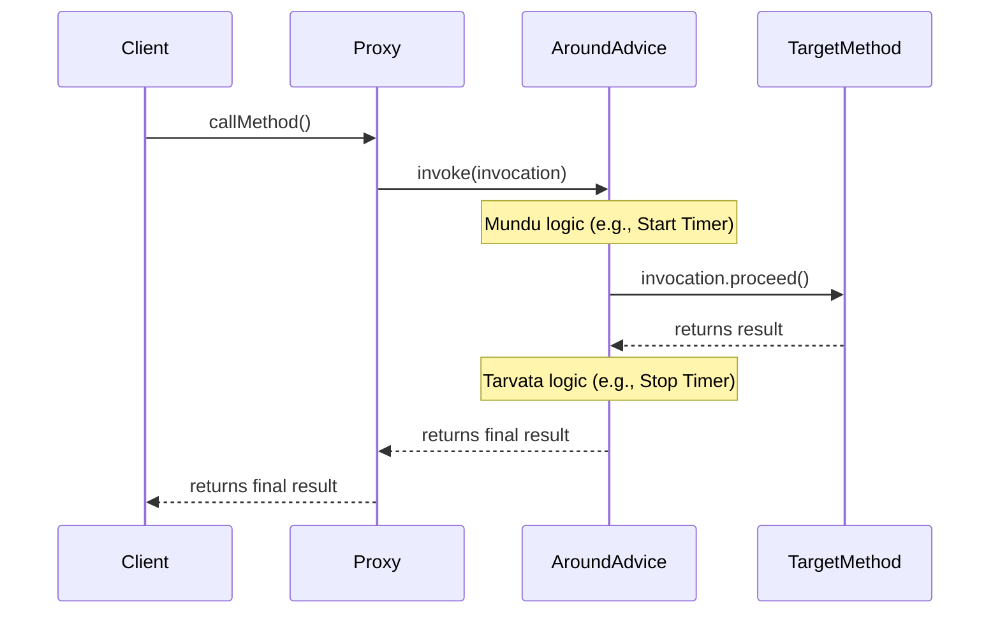

# AOP Part 3: The Advice API - The 'What' of AOP 👨‍💻

Mawa, last chapter lo manam Pointcut tho **"Ekkada"** (Where) logic apply cheyalo chusam. Ippudu, asalu katha loki vacham: **"Emi"** (What) apply cheyali? Ee "What" part eh **Advice**.

Advice ante simple ga, manam target method ki mundu, tarvata, or chuttu (around) execute cheyalanukune logic. Idi mana cross-cutting concern (logging, security, transactions) yokka actual implementation.

### Advice Lifecycle: Okate Sసారి or Prati Sసారి?

Spring lo Advice anedi oka Spring bean. Deeniki rendu jeevithaalu (lifecycles) undochu:
1.  **Per-class (Shared Advice):** Idi default and most common. Okate advice instance create ayyi, anni target objects ki share avutundi. Idi stateless logic (like logging) ki perfect.
2.  **Per-instance (Unique Advice):** Prati target object ki kotha advice instance create avutundi. Idi stateful logic (oka particular object ki matrame sambandinchina data ni track cheyali anukunte) kosam vadatam. Introductions (mixins) ki idi avasaram.

> **Teacher's Tip 🧑‍🏫:** 99% of the time, manam stateless, shared (per-class) advice ne vadatam. Keep it simple!

### The Main Types of Advice

Spring lo chala rakala Advices unnayi. Manam most important vaati gurinchi matladukundam.

---

#### 1. Around Advice (`MethodInterceptor`)

Idi anntikanna powerful and fundamental advice type. Idi oka method call ni complete ga wrap chestundi. Ante, method ki mundu konni panulu cheyochu, method ni execute cheyochu, and method execute ayyaka inkonni panulu cheyochu.

-   **Interface:** `org.aopalliance.intercept.MethodInterceptor`
-   **Key Method:** `invoke(MethodInvocation invocation)`

Ee `invocation` object chala powerful. Deeni thone manam original method ni `invocation.proceed()` ani call chestam.



**Superpowers 💪:**
*   Method execution ni control cheyochu (asal `proceed()` call cheyakunda undochu).
*   Arguments ni modify cheyochu.
*   Return value ni kuda modify cheyochu.
*   Exceptions ni handle cheyochu.

**Example:**
```java
public class PerformanceTimingAroundAdvice implements MethodInterceptor {
    public Object invoke(MethodInvocation invocation) throws Throwable {
        long startTime = System.nanoTime();
        try {
            // Proceed to the target method
            Object result = invocation.proceed();
            return result;
        } finally {
            long endTime = System.nanoTime();
            long duration = (endTime - startTime) / 1_000_000;
            System.out.println("⏰ Method '" + invocation.getMethod().getName() + "' took " + duration + " ms");
        }
    }
}
```

---

#### 2. Before Advice (`MethodBeforeAdvice`)

Idi chala simple. Target method execute avvadaniki **mundu** matrame run avutundi.

-   **Interface:** `org.springframework.aop.MethodBeforeAdvice`
-   **Key Method:** `before(Method method, Object[] args, Object target)`

**Superpowers 💪:**
*   Method execution ki mundu custom logic run cheyochu (logging, security checks).
*   Arguments ni chudochu, kani modify cheyalemu.
*   Return value ni change cheyaledu.

**Why is it useful?**
`proceed()` method ni call cheyalsina pani ledu, so manam marchipoye risk undadu. Chala safe and simple for pre-processing tasks.

**Example:**
```java
public class LoggingBeforeAdvice implements MethodBeforeAdvice {
    public void before(Method method, Object[] args, Object target) throws Throwable {
        System.out.println("✅ Executing: " + method.getName());
    }
}
```

---

#### 3. After Returning Advice (`AfterReturningAdvice`)

Idi target method successfully execute ayyi, oka value ni return chesaka **tarvata** run avutundi. Okavela method exception throw chesthe, idi run avvadu.

-   **Interface:** `org.springframework.aop.AfterReturningAdvice`
-   **Key Method:** `afterReturning(Object returnValue, Method method, Object[] args, Object target)`

**Superpowers 💪:**
*   Method return chesina `returnValue` ni access cheyochu.
*   **Important:** Return value ni chudagalam kani, **modify cheyalemu**.
*   Success scenarios lo logging or post-processing ki perfect.

**Example:**
```java
public class SuccessMessageAfterAdvice implements AfterReturningAdvice {
    public void afterReturning(Object returnValue, Method method, Object[] args, Object target) throws Throwable {
        System.out.println("✅ Method '" + method.getName() + "' executed successfully and returned: " + returnValue);
    }
}
```

---

#### 4. Throws Advice (`ThrowsAdvice`)

Idi oka special case. Target method execute ayyetappudu **exception** throw chesthe matrame idi trigger avutundi.

-   **Interface:** `org.springframework.aop.ThrowsAdvice`
-   **Key Point:** Idi oka **marker interface**. Ante, deenilo methods em undavu. Manam convention prakaram methods ni create cheyali.

Method signature ela undali:
`public void afterThrowing([Method, args, target], Throwable subclass)`

Manaki ye exception type ni handle cheyalo, aa exception type ni argument ga isthe chalu.

**Superpowers 💪:**
*   Centralized exception handling ki super useful.
*   Specific exceptions ni pattukuni, custom logic (e.g., sending an alert) rayochu.

**Example:**
```java
public class ExceptionHandlerThrowsAdvice implements ThrowsAdvice {
    // Ee method, IllegalArgumentException vachinappudu matrame call avutundi.
    public void afterThrowing(IllegalArgumentException e) throws Throwable {
        System.err.println("🚨 [THROWS ADVICE] - Invalid argument provided: " + e.getMessage());
    }
}
```

---

**Code Reference:**
Ee different advice types ki code example ni `Spring-Project` lo ee package lo chudochu:
`io.mawa.spring.core.aopapi.advice`

**How to Run the Code:**
1.  Navigate to the `Spring-Project` directory.
2.  Run the `AdviceTypesDemoApp.java` file's `main` method.
3.  You will see the output demonstrating the execution order of all four advice types for both a successful call and a call that throws an exception.

**How to Run the Tests:**
1.  Navigate to the project root in your terminal.
2.  Run the command `cd Spring-Project && mvn test`.
3.  You will see that all tests pass, including `AdviceTypesDemoAppTest`, which verifies the behavior of each advice type.

---

**Cliffhanger:**
Okay mawa, ippudu manaki "Ekkada" (Pointcut) and "Emi" (Advice) anevi telisayi. Kani veeti renditini kalipi, "Ee particular logic ni, ee particular place lo veyyi" ani Spring ki ela cheptam? Aa bandham peru enti? Enter the **Advisor**! Next chapter lo chuddam. 😉
