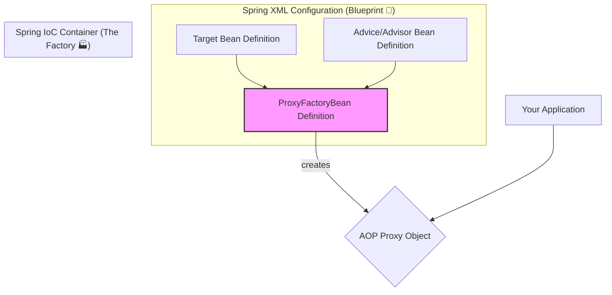

# AOP Part 5: ProxyFactoryBean - The AOP Assembly Line 🏭

Mawa, manam mundu `ProxyFactory` tho programmatic ga AOP proxies ela create cheyalo chusam. Adi bagundi, kani prati sari code lo antha setup rayadam konchem pedda pani.

Spring lo, "Don't Repeat Yourself" (DRY) anedi oka pedda mantra. Anduke, Spring manaki `ProxyFactoryBean` ane oka super tool ichindi.

> **Analogy:** `ProxyFactory` anedi manam parts anni techukuni, car ni mana chetulto assemble chesinattu. `ProxyFactoryBean` anedi oka car factory ki blueprint (XML config) ichi, "Naaku ee model car, ee features tho kavali" ani cheppinattu. Factory antha chusukuntundi! 🚗

`ProxyFactoryBean` anedi Spring IoC container tho kalisi pani chestundi. Manam XML lo or Java Config lo, AOP proxy ki kavalasina configuration antha declarative ga cheptam, and Spring container aa proxy ni create chesi manaki istundi.

### Key Properties of `ProxyFactoryBean`

Ee factory ki manam konni important properties cheppali:

1.  **`target`**: Ye original object (`bean`) ni manam proxy cheyali anukuntunnamo, aa bean reference.
2.  **`proxyInterfaces`**: Proxy object ye interfaces ni implement cheyalo cheptam. (Idi isthe, Spring `JDK Dynamic Proxy` ni vadutundi).
3.  **`interceptorNames`**: Idi chala important. Ee proxy ki ye `Advice` or `Advisors` apply cheyalo, vaati bean names (String format lo) oka list la istham.
    *   **Note:** Ikkada manam direct ga bean reference ivvamu, bean names matrame istam. Endukante, stateful advice (prototype scope) unte, Spring prati sari kotha instance create cheyali, anduke name reference vadutundi.
4.  **`proxyTargetClass`**: Okavela manam interface kakunda, direct ga class ni proxy cheyali anukunte (legacy code tho pani chesetappudu), deenini `true` ga set cheyali. Appudu Spring `CGLIB Proxy` ni vadutundi.

### How it Works - The Blueprint View



### Example: XML Configuration

Ikkada oka simple example chuddam. Manaki oka `DocumentService` undi, daaniki manam oka `DebugInterceptor` apply cheddam.

```xml
<!-- 1. The Target Bean (The original object) -->
<bean id="documentServiceTarget" class="io.mawa.spring.core.aopapi.proxyfactorybean.DocumentServiceImpl">
    <!-- properties if any -->
</bean>

<!-- 2. The Advice/Interceptor Bean -->
<bean id="debugInterceptor" class="org.springframework.aop.interceptor.DebugInterceptor"/>

<!-- 3. The ProxyFactoryBean (The Magic!) -->
<bean id="documentService" class="org.springframework.aop.framework.ProxyFactoryBean">

    <!-- Which interfaces should the proxy implement? -->
    <property name="proxyInterfaces">
        <value>io.mawa.spring.core.aopapi.proxyfactorybean.DocumentService</value>
    </property>

    <!-- What is the target object? -->
    <property name="target" ref="documentServiceTarget"/>

    <!-- Which interceptors/advisors to apply? (Use bean names) -->
    <property name="interceptorNames">
        <list>
            <value>debugInterceptor</value>
        </list>
    </property>
</bean>
```
Ippudu manam container nunchi `"documentService"` ane bean ni adigithe, manaki original object radu, AOP logic tho wrap chesina proxy object vastundi!

**Code Reference:**
Ee `ProxyFactoryBean` example ki code and XML ni `Spring-Project` lo ee package lo chudochu:
*   **Code:** `io.mawa.spring.core.aopapi.proxyfactorybean`
*   **XML:** `src/main/resources/pfb-context.xml`

---

**Cliffhanger:**
XML lo antha rayadam konchem verbose anipinchinda? "Inka simple ga cheyaleva?" ani Spring team ni adigithe, వాళ్ళు "Yes, we can!" annaru. Next, manam inka concise (chinnaga) proxy definitions ela rayalo chuddam. Get ready for more AOP shortcuts! ✨
